# 데이터 테이블·ERD 설계

1단계 데이터 테이블·ERD 설계(09-16) 산출물 1. 표 17개의 의미·키·관계, 표 설계 근거, 적재 검증 규칙, ERD.

## 상태

| 항목 | 값 |
|---|---|
| 판 | v2.2 검토안 (2026-10-04, 이슈 #42). 이전 판 v2.1(2026-09-23) |
| 규모 | 17개 표 · 42개 관계 · enum 26개 (v2.1: 20개 표 · 47개 관계 · enum 30개). 변경 내용: 아래 「v2.2」 |
| 기준 | [DBML](schema.dbml)이 칼럼·복합키의 정본. 칼럼 전체는 [스키마 명세](schema-catalog.md) |
| 반영한 팀 결정 | 09-20 7차 미팅 3건: run_id 통일, fund_key 고정, 비교 모집단 별도 표 |
| 승인 | 수정 1~9와 B11 안 1은 10월 3일 팀 채널에서 이의 없이 확정, 수정 10은 9차 미팅(9월 30일) 확정. 결정 대기 표시 항목과 CDI 산식 담당 승인은 미완료 |
| 범위 밖 | DB 제품, 물리 DDL, 인덱스 튜닝, decimal 정밀도 → 2단계 데이터 파이프라인 Flow 설계 |
| 결정 대기 | 결정 대기 A·E, C(10월 8일 PM 확정, 데이터 사이언스(다빈) 이의 확인 대기), 10월 4일 판단 항목 4건, 그대로 미결인 B·D·F·G·H·I·B5·B12·B13 (아래 「v2.2」·「미결」) |

## 결정 요약

| 결정 | 왜 중요한가 | 근거 |
|---|---|---|
| 문서 한 행 = 수집한 원천 문서 1건 | 금투협 15행이 가리키는 PDF가 하나. 클래스 단위면 같은 본문을 15번 추출 | [금투협 중복 행 검증](records/phase1-erd/kofia-rows-and-etf-rule.md) 「검증 1: 금투협 중복 행」 |
| 상품 행 = 클래스 | 단축코드·srtnCd가 클래스 단위. 펀드 단위면 1차 조인 키가 유일하지 않게 됨 | 09-16 아키텍트 판정 |
| fund_key = 한 번 발급하면 바뀌지 않는 서러게이트 | 이름 정정·정규화 규칙 변경 때 과거 펀드 묶음이 바뀌지 않음 | 09-20 팀 결정 |
| 문서↔상품 N:M. 1:N은 수시공시에서만 실측 | 정기공시 평균 1.08행을 1:1 제약으로 바꾸면 적재 실패 | 「문서와 소스별 키」 |
| 추출 run과 채점 run 분리. 공식 채점 run 하나 | 산식만 바꿀 때 추출·절 재적재 불필요. 대시보드가 보여줄 점수가 하나로 정해짐 | 「실행과 비교 모집단」 |
| 추출 결과 키 = 원본 파일 × 파서 버전 (v2.2) | 같은 파서로 추출한 파일은 다시 추출하지 않음. 새 실행이 추출 결과를 복제하지 않음 | 「v2.2」 |
| 원본 바이트 불변 | 과거 점수 재현의 전제 | [원본 보관과 수집·파싱 실패 처리 규칙](storage-and-failure-rules.md) 「원본 보관」 |
| 분쟁조정·제재공시는 상품에 연결하지 않음 | 상품명 마스킹. 매칭을 시도하면 실패율만 실제보다 크게 나옴 | [조인 키 확인 기록](records/phase1-erd/join-key-checks.md) 「분쟁조정 마스킹」 |
| 점수 대상 = 절·문서·문서쌍·펀드 4종 (v2.2: score 표의 대상 칼럼) | 가짜 절 없이 문서 순서·요약 비교·펀드 최종값 저장 가능. 드릴다운의 절 단위 근거 유지 | 「절과 점수 대상」 |
| 점수 유형은 metric_key(불변 지표 버전)로 구분 | ELS 행에 CDI 빈칸이 생기지 않음. 산식 변경을 새 버전으로 추적 | 「절과 점수 대상」 |
| 계산 불가 = 결과 상태 + NULL 원점수 | 0점과 계산 불가를 구분 | [점수 저장과 비교 모집단](scoring-and-population.md) 「결과 상태와 결측」 |
| 매칭 실패는 건수가 아니라 행 단위로 기록 | ETF·특정 판매사에 실패가 몰려 표본이 한쪽으로 치우치는지 사후 검증 가능 | [매칭 규칙](matching-rules.md) 「매칭 실패 기록」 |
| 정정본 판정은 규칙으로 먼저 확정, SCD 구현은 2단계. 판매 중 여부의 판단 근거는 미결 | 이력 구현보다 규칙이 먼저 필요 | [점수 저장과 비교 모집단](scoring-and-population.md) 「기준일과 대표본 선택」 |
| 근거 위치 형식은 절 + 문자 범위(B11 안 1, 10월 3일 확정) 유지. 문장 테이블은 신설하지 않음 (10월 7일 분석·리서치(민석) 제안 검토 후 기존 설계 유지, 10월 8일 PM(대현) 결정) | 문장 테이블을 두면 표가 17개에서 18개로 늘고, 같은 근거 위치를 두 형식으로 갖게 됨 | 「두 파트 출력의 저장 계약」 |

## v2.2 (2026-10-04, 이슈 #42)

v2.1(2026-09-23)에서 9월 30일 재검토 확정안을 반영한 판. 확정 항목은 DBML에 반영했고, 결정 대기 항목은 기본값으로 반영한 뒤 반대로 결정될 때 바뀔 범위를 적었다.

| 항목 | v2.1 | v2.2 |
|---|---|---|
| 표 | 20개 | 17개 (4개 연기, analysis_target 병합, 2개 추가) |
| 관계(FK, 복합 FK는 1개로 셈) | 47개 | 42개 |
| enum | 30개 | 26개 (5개 제거, risk_grade_source_enum 1개 추가) |

### 결정 상태

| 구분 | 항목 |
|---|---|
| 확정(10월 3일 팀 채널, 이의 없음) | 수정 1~9, B11 안 1 |
| 확정(9차 미팅 9월 30일) | 수정 10 두 파트 출력 저장 |
| 확정(10월 4일 PM 승인) | 수정 11 S3 트리와 llm_field_extraction.response_sha256 추가, 수정 12 distributor.kofia_disclosure_company_code 추가(운용사 연결 순서) |
| 기본값으로 반영, 결정 대기 | A 병합, E 체계별 두 칼럼 |
| 확정(10월 8일 PM 결정), 데이터 사이언스(다빈) 이의 확인 대기 | C 펀드 관측치 표 없음(manifest 파일). 대시보드는 층내 백분위만 표시(score 칼럼), 층 배정은 실행 폴더 파일. 대시보드를 DB에 직접 연결하거나 잔차·층 배정의 SQL 분석이 필요해지면 표 추가 |
| 10월 4일 판단 항목, 기본값으로 반영, 결정 대기 | 펀드 대표 위험등급 칼럼, 클래스 등급 불일치 기록, 문서 작성기준일, 간이 대표 역할 |
| 그대로 미결 | B(run 일치 복합 FK, 현행 유지), D(product_distributor 적재 시점, 표 유지), F(정규 절 분류 값 규칙), G(평가 저장), H(B3·B4 보류), I(score 상태 칼럼으로 정리), B5(대시보드 읽기 뷰, DBML 밖), B12·B13 |

### 수정 항목별 반영

| 수정 | 반영 내용 | 위치 |
|---|---|---|
| 1 채점·평가 표 4개 연기 | score_dependency, evaluation_run, evaluation_response, analysis_target_member를 DBML에서 뺌. 쓰는 곳이 없어진 enum 5개도 뺌. 표 정의는 「예약 계약(승인 뒤 추가)」에 요지만 남김. 실제 가중치는 score_payload 또는 definition_manifest | schema.dbml, 이 문서 |
| 2 추출 키 변경 | file_extraction PK = (raw_object_id, parser_version). 재사용은 EXTRACT_OK 행만, FAILED/PARTIAL은 다음 실행이 덮어씀. 수정 2로 절 쪽 run 일치 복합 FK는 없어지고 절 검증은 SCORE 입력 manifest로 함, section은 같은 키로 file_extraction 참조. run_id를 끌고 다니던 복합 FK(analysis_target·member의 extraction_run_id 등)와 pipeline_run (run_id, upstream_run_id) 유일키 제거. B9(derived 경로의 서러게이트 ID) 해소 | schema.dbml, [원본 보관과 수집·파싱 실패 처리 규칙](storage-and-failure-rules.md) 「파일 경로」 |
| 3 코드 체계 불일치 | 포털 asoStdCd를 접두 3자로 분기해 K55는 kofia_fund_code, KR5/KRM은 standard_code. 결정 대기 E | schema.dbml, [매칭 규칙](matching-rules.md) 「코드 체계 분기」 |
| 4 절 식별 칼럼 | section.canonical_section_code 추가. 값 규칙은 결정 대기 F | schema.dbml, [DART 절 분할](records/phase1-erd/dart-section-split.md) |
| 5 빠진 표 2개 | llm_field_extraction(문서 × 필드 × 시도, 모델 이름·프롬프트 해시·토큰 수·근거 위치·응답 해시), source_watermark(소스 × 조회 범위, 구간 완전성 검증 뒤에만 전진) | schema.dbml |
| 6 채울 수 없는 칼럼 제거 | product의 sale_start_date, sale_end_date, is_public_offering, fin_prdt_cd와 document.pblntf_detail_ty 제거. 판매 중 여부의 판단 근거는 「미결」 | schema.dbml, [점수 저장과 비교 모집단](scoring-and-population.md) 「판매 중 확인」 |
| 7 형식 오류 정정 | 아래 표 | 이 문서, [데이터 소스 수집 명세](data-sources.md) |
| 8 B7 정정 | manifest 저장 기준 통일만 채택(큰 불변 자료는 파일, SQL 필터 대상은 칼럼). RFC 8785 요구 삭제, 키 정렬 규칙 한 줄 | 「절과 점수 대상」 6번 |
| 9 B8 채택 안 함 | 지표 승인 이력 표 없이 metric_definition 칼럼 또는 definition_manifest에 기록 | schema.dbml |
| 11 S3 트리 확정 | raw 폴더를 수집일·해시 폴더에서 읽을 수 있는 원천 키 폴더로 변경. source 이름공간을 5개에서 7개로 확대(data_go_fund, krx_etf_daily 추가). llm_field_extraction에 response_sha256 칼럼 1개 추가(표 수·관계 수·enum 수는 그대로). raw_object.storage_path와 raw_response_path의 경로 형식 주석 갱신 | schema.dbml, [원본 보관과 수집·파싱 실패 처리 규칙](storage-and-failure-rules.md) 「파일 경로」「적재 순서」 |
| 12 운용사 연결 순서 | distributor에 kofia_disclosure_company_code 칼럼 1개 추가(UNIQUE, NULL 허용). 금투협 공시 목록의 운용사 코드(`A01021` 형식)를 담아 현재 운용사로 연결. 표준코드 안 3자리 코드는 설정 당시 운용사라 합병·상호 변경 뒤 틀릴 수 있음. 표 수·관계 수·enum 수는 그대로 | schema.dbml, [매칭 규칙](matching-rules.md) 「운용사 연결 순서」 |
| 10 두 파트 저장 계약 | 문서에 이미 있음. DBML score_payload 주석을 파트 B 축 1·2, 축 구성별 지표 버전, 작성기준 항목 점검 행과 맞춤 | 「두 파트 출력의 저장 계약」 |

#### 수정 7 형식 오류 정정 6건

| 정정 | 내용 |
|---|---|
| 코드 자릿수 근거 | KRX ISU_CD는 6자리 영숫자(표본 1,167건 모두 6자리, 숫자만 864건, 영문 포함 303건). DART rcept_no 14자리·corp_code 8자리는 v2.1에서 이미 반영되어 있었고 09-30 목록 API 실측 근거를 기재 |
| standardDt 두 형식 | 공시 목록 응답은 YYYYMMDD, 판매회사 마스터 조회(option=S2)는 YYYYMM. 한 칼럼에 섞지 않음 |
| char_start 단위 | 줄 번호가 아니라 글자 위치(Unicode code point) |
| 본문 경계를 못 찾은 절 | section.extract_status에 SECTION_BOUNDARY_NOT_FOUND 추가 |
| 금투협 companyCd | 공시 목록 응답의 운용사 지정 칸을 원천 필드 표에 추가(문서 키 첫 필드) |
| 운용사 코드 1:1 아님 | DART 법인과 금투협 운용사 코드의 대응표에 없는 값 7종. 10월 4일 실측으로 정리(matching-rules.md 「대응표에 없는 운용사 코드」) |

### 결정 대기와 반대로 결정될 때 바뀌는 범위

| 항목 | 기본값 | 반대로 결정되면 |
|---|---|---|
| A 병합 | analysis_target을 만들지 않고 score가 target_type, section_id, document_id, fund_key, target_key를 직접 가짐. B10(score.target_type과 지표 일치)은 복합 FK로 채택 | analysis_target 표 1개 복원. score의 대상 칼럼 4개 제거하고 target_id FK로 바꿈. score 유일키를 (run_id, target_id, metric_key, assessor_key)로 되돌림. population_snapshot은 영향 없음(score가 (population_snapshot_id, run_id, metric_key)로 참조하는 방식 그대로). analysis_target_member 연기 상태는 별개 |
| C 펀드 관측치 | 표 없음. 실행마다 manifest 파일 | 펀드 관측치 표 1개 추가 |
| E 코드 체계 | K55 체계 칼럼(kofia_fund_code)과 KR5/KRM 체계 칼럼(standard_code) | product 칼럼 2개와 매칭 규칙의 분기 절만 바뀜 |
| 펀드 대표 위험등급 | fund_group에 representative_risk_grade, risk_grade_source_document_id, risk_grade_source_kind와 risk_grade_source_enum(작성기준일은 근거 문서의 report_base_date) | 칼럼 3개와 enum 1개 제거, 관계 1개 감소(42 → 41). 층 배정은 product.risk_grade |
| 클래스 등급 불일치 | match_failure 실패 사유(failure_reason_enum)에 CLASS_GRADE_MISMATCH 추가. 클래스 product_id·대표 등급·클래스 등급·값 출처는 상세 JSON(resolution_note 안)에 기록, 칼럼 추가 없음 | enum 값 1개 제거. 매칭 실패와 목적이 다르므로 별도 표로 분리할지도 함께 결정(분리하면 표 1개 추가, 클래스 product_id FK 포함) |
| 문서 작성기준일 | document.report_base_date. 비교한 작성기준 판과 표 영역 구분은 칼럼 없이 파일(구조 manifest, 작성기준 판 버전 파일) | 칼럼 제거 후 manifest로 이동, 또는 작성기준 판 표 추가 |
| 간이 대표 역할 | enum 변경 없음. pipeline_run.selection_manifest_path가 가리키는 selection manifest 파일에 역할별 기록(analysis_target_member 연기에 따름) | member 역할 enum(SIMPLE 등)과 analysis_target_member 복원. 이때 A 결정과 함께 정함 |

- LLM 추출 표(llm_field_extraction)는 이번 버전에서 문서 단위로 확정(유일키 (run_id, document_id, field_name, attempt_no)). 파일 단위로 바꾸면 raw_object_id를 유일키에 넣음(표 수 변화 없음, 칼럼 제약만 바뀜). 전환 여부는 미결
- 결정 A가 병합으로 확정되면 score 유일키가 target_key 기반인 이유(대상 칼럼이 NULL을 허용하므로 유일키에 직접 넣지 않음)를 그대로 유지
- selection manifest(pipeline_run의 칼럼 2개)는 spec의 「selection_manifest 파일」을 둘 자리로 v2.2가 정한 위치. 위치가 다르게 결정되면 칼럼 2개만 옮김

## 표 목록과 한 행의 의미

| 표 | 한 행의 단위 | 역할 |
|---|---|---|
| fund_group | 고정된 펀드 묶음 하나 | 이름 변경에도 유지되는 fund_key의 발급·조회 기준. v2.2(결정 대기): 펀드 대표 위험등급과 근거 |
| product | 상품 클래스 하나의 현재 마스터 | 단축코드·K55 체계/KR5·KRM 체계 코드·상품명·현재 분류 |
| distributor | 법인 하나 | 운용사·판매사·겸업을 같은 법인으로 관리 |
| product_distributor | 상품 × 판매사 × 월 | 월 대표 판매관계와 실제 조회일·원천 파일 |
| document | 소스 안의 공고·접수·게시글 하나 | 소스별 문서 식별과 확인된 정정 계보. v2.2(결정 대기): 작성기준일 |
| document_product | 문서 × 상품 | 다대다 연결의 근거·방법·점수 |
| raw_object | 저장한 응답/첨부 바이트의 한 버전 | 문서 파일뿐 아니라 상품/KRX/API 목록 원본 |
| collection_attempt | 실행 안의 요청 한 번 | 파일이 없는 타임아웃, 정상 0건, 재시도도 기록 |
| pipeline_run | 논리 실행 하나 (EXTRACT 또는 SCORE) | 기준일·파서·산식·입력 스냅숏을 한 번호로 고정. SCORE는 upstream_run_id로 EXTRACT 참조, is_official이 공식 채점 실행 표시 |
| file_extraction | 원본 파일 × 파서 버전 (v2.2) | 파서 버전별 추출 상태와 전체 텍스트 |
| section | 파일·파서 버전 안의 실제 구간 하나 | 원문 부/절·요약·정규 절 분류와 정확한 위치 |
| score | 실행 × 대상 × 지표 버전 × 평가자 | 원자값·축값·최종값 및 계산 불가 상태. v2.2(결정 대기 A): 대상 칼럼(target_type, section_id, document_id, fund_key)을 직접 가짐 |
| population_snapshot | 실행 안의 비교 층 하나 | 비교 정의·건수·실제 구성원 스냅숏 |
| match_failure | 매칭 시도 하나 | 상품/법인 후보·실패 사유·해결 기록 |
| metric_definition | 지표의 불변 버전 | 계산 단위·산식·방향·승인 상태 |
| llm_field_extraction | 실행 × 문서 × 필드 × 추출 시도 (v2.2 신규) | LLM 6필드 추출 결과·모델 이름·프롬프트 해시·입력 텍스트 해시(10월 9일)·토큰 수·근거 위치·응답 파일 경로와 해시 |
| source_watermark | 소스 × 조회 범위 (v2.2 신규) | 소스별로 어디까지 받았는지. 구간 완전성 검증 뒤에만 전진 |

- 연기한 표 4개(score_dependency, evaluation_run, evaluation_response, analysis_target_member)와 병합한 analysis_target은 표 목록에 없음. 요지: 「예약 계약(승인 뒤 추가)」
- 표 수 변천(9 → 14 → 20 → 17)과 각 판의 검증 기록: [ERD 설계 변천과 검토 기록](records/phase1-erd/design-review-history.md) 「변천 요약」

## 표 설계 근거

### 14표 시점에 추가한 5개 표

| 표 | 추가 이유 |
|---|---|
| fund_group | 09-20 고정 키를 발급·조회할 자리 필요. 이름에 UNIQUE를 걸면 모·자·호수가 한 묶음으로 합쳐짐 |
| pipeline_run | 이미 채택된 run_id 개념의 논리 구체화. 속성·정밀도는 승인 전 |
| population_snapshot | 이미 채택된 비교 모집단 개념의 논리 구체화 |
| collection_attempt | 바이트 없는 실패·정상 빈 응답·인증/한도 오류를 원본 파일과 같은 행으로 표현 불가 |
| file_extraction | 같은 파일에 여러 파서 결과 발생. raw의 extract_status 한 칸으로는 과거 점수 설명 불가 |

- 앞의 셋(fund_group, collection_attempt, pipeline_run)을 raw_object에 합치면 상품 묶음·요청·실행 단위가 파일 단위와 충돌
- 실행별 추출 결과가 없으면 과거 절 재현 불가

### v2에서 추가한 6개 표 (v2.2에서 1개만 유지)

| 추가 표 | 한 행 | 필요한 이유 |
|---|---|---|
| metric_definition | 지표의 불변 버전 | ASL·축값·CDI·변환값의 계산 단위/산식/승인 상태 구분 |
| analysis_target | 실행 안의 절/문서/쌍/펀드 대상 | 가짜 절 없이 최종 문서·펀드 점수 저장 |
| analysis_target_member | 대상에 사용한 파일/구간과 역할 | 같은 PDF의 요약/본문, 별도 PDF, 여러 근거 구간 표현 |
| score_dependency | 출력 점수와 입력 점수 사이 의존관계 | 절→축→최종값의 실제 계산 근거와 가중치 조회 |
| evaluation_run | 사람 또는 LLM 평가 실행 | 채점 실행과 별개인 실험·재채점 버전 관리 |
| evaluation_response | 실행·쌍·응답자·대상·문항·조건·반복 | 원응답·누락·채점·제시순서 보존 |

- v2 당시 새 표 6개는 빈 예약 표가 아니라 칼럼·키·참조·검증 계약을 갖춤
- 기존 수집·원본·추출·절·상품 계보는 유지하고 score의 대상만 일반화
- score 유일키: `target_id + run_id + metric_key + assessor_key`. PK는 계속 `score_id`
- 옛 score 칼럼 이동: `section_id` → 대상, `score_type` → 지표, `section_weight` → 의존관계, `baseline_date` → 실행
- metric_key별로 원자 지표·축값·최종값을 별도 행에 저장
- `score_payload`: 관계형 키의 대체물이 아니라 지표별 항목 판정과 근거 상세
- 파일 manifest: 문항 묶음·설정·모집단 회원·페이지 구조처럼 실행 후 불변인 큰 자료
- 관계형 칼럼: 실제 점수와 응답 중 SQL 조회가 필요한 공통 필드
- v2.2 결과: 이 6개 표 중 score_dependency·evaluation_run·evaluation_response·analysis_target_member 4개는 DBML에서 뺌(수정 1, 「예약 계약(승인 뒤 추가)」). analysis_target은 score에 병합(결정 대기 A). metric_definition만 그대로 남음

### 대안 비교

| 대안 | 장점 | 문제 | 선택 |
|---|---|---|---|
| 기존 9개 표에 run 문자열만 추가 | 변경이 작음 | 실패 요청·원본 파일·추출 실행 혼재, 묶음 키 발급 근거 없음 | 채택하지 않음 |
| 5개 최소 엔티티 추가 + 불변 manifest | 각 입도 분리, DB 중립, 실행 재현 가능 | 표 5개와 파일 manifest 검증 증가 | 09-22 검토안(14표) |
| 완전한 SCD2/법령/LLM/지표/모집단 회원 테이블 모두 구현 | 모든 이력에 SQL 조회 가능 | CDI 산식·DB·법령 대응 미정인데 큰 모델을 먼저 고정 | 보류 |
| 지표별 테이블 분리 | 지표마다 칼럼 명확 | 중복·집계 코드 증가 | 채택하지 않음 |
| 모든 결과를 JSON 하나에 저장 | 스키마 변경 없음 | 참조·입도 검증 약화 | 채택하지 않음 |
| score 대상 일반화 + 표 6개 추가 | 문서/쌍 대상, 숫자 없는 결과, 복수 평가자 수용 | 조건부 검증 규칙 증가 | v2 검토안(20표) |

- 받아들인 비용: 파일 manifest도 백업·해시 검증 대상. 재실행 시 절 메타데이터 중복 가능
- 추가하지 않은 것: 재사용을 위한 다중 버전 참조 그래프
- 되돌림 조건: 입력량 증가 또는 여러 팀의 독립 채점 → 분리 실행·회원 테이블 재검토
- 되돌림 조건: 모집단 회원 SQL 역조회 요구 → 같은 계약을 population_member 관계 테이블로 이전
- 6관점 검토의 15표·17표 대안: [ERD 설계 변천과 검토 기록](records/phase1-erd/design-review-history.md) 「v2 6관점 검토」

## 상품과 법인

### product / fund_group

- PK: 내부 `product_id`
- `short_code`는 UNIQUE 아님
  - 코드가 같은 후보가 여러 개면 전체 코드·운용사·클래스 대조
  - 해소되지 않으면 `AMBIGUOUS`
  - `standard_code`의 전역 유일성도 이번 표본만으로 강제하지 않음
- 코드 길이: `short_code` 문자열 5자리, `kofia_fund_code`·`standard_code` 각각 문자열 12자리
  - K55와 KR5/KRM을 섞지 않음. 체계별 두 칼럼(결정 대기 E, 기본값): `kofia_fund_code` = K55 체계, `standard_code` = KR5/KRM 체계
  - 공공데이터포털 `asoStdCd`에 두 체계가 섞여 있음(ETF 대조 표본 1,373건 중 K55 1,195건, KR5 178건). 접두 3자로 분기해 한쪽 칼럼에 넣음([매칭 규칙](matching-rules.md) 「코드 체계 분기」)
  - 단축코드는 DART 표지 또는 포털 `srtnCd` 원문 사용
- 포털 필드 매핑: `product_name` = `fndNm`, `inception_date` = `setpDt`, `source_baseline_date` = `basDt`
  - `setpDt`는 설정일. 판매개시일 아님
- `manager_id`: 포털에 운용사 필드가 없어 연결 전 NULL 허용
  - 등록 사실은 보존
  - 운용사/펀드 묶음 미확정 행을 비교 모집단에 넣지 않음
- `fund_key`: `fund_group`의 고정 서러게이트 FK
  - 신규 클래스는 기존 묶음을 먼저 찾고, 없을 때만 새 번호 발급
  - 모자 구분·호수·유형 보존, 클래스 표기만 제거
  - 이름 변경 때 재발급하지 않음
- `fund_group.canonical_name`은 UNIQUE 아님
  - 동일한 이름의 모/자 펀드나 다른 회차를 강제로 합치지 않음
  - 이름 변경 대응은 실행 입력 manifest의 매칭 근거로 보존
  - 대규모 별칭 이력 관리가 필요하면 2단계 데이터 파이프라인 Flow 설계에서 확장
- `risk_grade`: 1~6 또는 NULL
  - DART 표지와 금투협 첨부를 모두 근거로 사용 가능. 충돌 시 임의 선택 금지
  - 현재 값의 근거는 `risk_grade_raw_object_id`, 과거 값은 실행 입력 manifest에 고정
  - 공시된 펀드 위험등급(1~6등급)을 그대로 쓰고 사람이 다시 매기지 않음(9차 미팅)
  - 펀드 등급 규칙(10-03 데이터 사이언스(다빈) 제안, 10-04 PM 채택). 근거 표기는 기업공시서식 작성기준 「19-3-5조 ⑦항」으로 통일
    - 법적 근거: 자본시장법 231조 ①항은 종류형 집합투자기구의 발행 구조를, 작성기준 19-3-5조 ⑦항은 위험등급·부여 사유·적합한 투자자 유형의 기재를 정함. 두 조항 모두 클래스마다 등급이 같아야 한다고 요구하지는 않음
    - 펀드 대표 등급을 하나 정하는 것은 법적 의무가 아니라 10-04 PM 결정. 아래 클래스 등급 불일치 기록과 함께 쓰는 분석 규칙
    - 펀드 대표 등급 출처: 간이투자설명서 표제의 공시 등급. 간이가 없으면 투자설명서 표지 등급(PM 결정). 두 문서 등급이 다르면 확인 대상
    - 기준 시점: 문서 작성기준일 시점의 공시 등급. 등급은 결산마다 바뀔 수 있음
    - 클래스 등급이 대표 등급과 다르면 판매사 재분류나 데이터 오류로 보고 확인 대상으로 기록. 클래스 값을 대표 등급으로 덮어쓰지 않음. 판매사는 2023년 금융위 가이드라인에 따라 자체 등급을 매길 수 있어 판매사·API 값은 운용사 공시와 다를 수 있음. 그래서 불일치 기록에 그 값의 출처(운용사 공시, 판매사, API)를 함께 남김. 기록 위치: match_failure의 실패 사유 `CLASS_GRADE_MISMATCH`, 값 출처는 attempted_key_value 또는 resolution_note(10월 4일, 결정 대기 — 「v2.2」)
    - 판매사가 자체 기준으로 다시 매긴 등급은 쓰지 않음. 운용사 공시 등급만 사용
      - 10월 7일 분석·리서치(민석) 조사(Notion 「위험등급 산정 규칙」)로 위 방침(운용사 공시 등급 사용, 다시 매기지 않음, 판매사 등급 미사용, 산정 주체는 운용사로 고정해 칼럼을 두지 않음)이 그대로 유지됨을 확인. 금소법 19조 ①항 1호 나목 3의 법정 위험등급은 판매사가 정하는 등급이며 공개된 원천이 없음. 투자설명서의 등급은 운용사 내부기준에 따른 등급
    - 등급 산정 요소값의 자리(10월 8일 PM(대현)): 투자설명서에 적힌 산정 기준(주간 수익률 변동성, VaR 등 산정 방식 이름)과 측정값을 원본 추출값으로 받을 LLM 추출 필드 이름 2개를 예약함. `llm_field_extraction`은 필드마다 한 행(field_name)이라 표 구조는 바꾸지 않음
      - `risk_grade_basis`(산정 기준), `risk_grade_measure`(측정값): 예약, 추출 미실시. 10월 21일 100건 비용 실측 뒤 추출 여부 결정(PM(대현) 10월 8일). 필드 목록: [3단계 입출력 Schema 설계 입력](io-schema.md) 「LLM 추출 결과 JSON 요구」
      - 9월 14일 「위험등급 요소별 값 저장 채택 안 함」 판정([초기 소스 확인](records/phase1-erd/initial-source-checks.md) 「네 충돌의 판정」 2번)을 바꾸는 것은 자리를 두는 것까지. 등급 값은 계속 공시 등급만 씀
    - 모자형은 자펀드 등급, 재간접은 그 펀드 자체 등급, 레버리지·인버스 ETF와 부동산 펀드는 공시 등급 그대로
    - 외국 엄브렐러 펀드(하위 펀드별 등급): Phase 1 비교 집단에서 제외하고 제외 사유 기록(PM 결정). 하위 펀드 분리는 건수 확인 뒤 재검토
  - 층 배정(고유 fund_key 30개 기준)은 펀드 대표 등급으로 함. 클래스 간 등급이 다른 건수는 데이터 사이언스(다빈)가 10-08까지 확인
  - 펀드 대표 등급 저장(10월 4일, 결정 대기): `fund_group.representative_risk_grade`와 근거 칼럼 2개(`risk_grade_source_document_id`, `risk_grade_source_kind`; 작성기준일은 근거 문서의 `document.report_base_date`). 출처 구분은 간이투자설명서 표제 / 투자설명서 표지. 클래스 값은 `product.risk_grade`에 그대로 두며 대표 등급으로 덮어쓰지 않음
- v2.2에서 `sale_start_date`·`sale_end_date`·`is_public_offering`·`fin_prdt_cd`를 제거함(수정 6). 이유: 원천에서 채울 수 있는 소스가 없음(설정일 `setpDt`는 판매개시일이 아님, 판매종료일 소스 없음, 공모/사모 구분 필드 없음, finlife에 펀드·ETF 없음)
  - 판매 중 여부를 무엇으로 판단하는지는 이 제거로 근거 칼럼이 사라져 미결. 「미결」 참조. 후보 범위와 확인 범위의 구분은 [점수 저장과 비교 모집단](scoring-and-population.md) 「판매 중 확인」
- `valid_from/valid_to`: 기존 SCD 예비 칸
  - 현재 PK 하나로는 SCD2 여러 행 저장 불가
  - 버전 PK 설계 전까지 현재 마스터와 불변 실행 입력 manifest로 분리

| etf_confidence | is_etf | product_category | 비교 모집단 |
|---|---|---|---|
| KRX_CONFIRMED | true | ETF | 나머지 자격 충족 시 포함 |
| NOT_ETF | false | 확인된 펀드/ELS | 펀드는 자격 충족 시 포함, ELS는 CDI 제외 |
| NAME_ONLY | NULL | NULL | 이름 기반 후보이므로 제외 |
| PENDING | NULL | NULL | 판정 보류로 제외 |

- NOT_ETF: 비ETF 확인 근거가 있을 때만 사용
  - KRX 미매칭 또는 이름에 「상장지수」가 없다는 사실만으로 비ETF 확정 금지
- `is_etf`는 파생 계산 아님. KRX 대조(1차) → 문자열 규칙(2차)의 판정 결과이며, 어느 단에서 정해졌는지를 `etf_confidence`가 기록
- ETF 판정 규칙 상세: [매칭 규칙](matching-rules.md) 「ETF 판정」
- ELS 식별 키·발행사 모델은 Phase 2 미정. NULL 허용이 ELS 적재 완료를 뜻하지 않음
- ELS는 Phase 1 범위 밖(9차 미팅, 1차 구현은 펀드·ETF만). `product_category` enum의 `ELS` 값은 유지하며 Phase 2에서 검토

### distributor / product_distributor

| 항목 | 규칙 |
|---|---|
| kofia_sales_code | `saleCompCd`, 표본 200건의 6자리 유일 문자열. 운용사 코드와 별개 |
| kofia_disclosure_company_code | 금투협 공시 목록의 운용사 코드(`A01021` 형식). 현재 운용사 기준. 운용사 연결 1순위 키 |
| kofia_mgmt_code | 금투협 운용사 코드 3자리(표준코드 4~6번째 자리). 펀드 설정 당시 운용사라 합병·상호 변경 뒤에는 현재 운용사와 다를 수 있음. `corp_code`와 대응 검증 필요 |
| corp_code | DART 제출 법인 코드. 숫자로 바꿔 선행 0을 잃지 않음 |
| distributor_type | 운용사 / 판매사 / 겸업 / 미상. 상품 manager는 운용사·겸업만 |
| 판매관계 PK | `(product_id, distributor_id, snapshot_month)` |
| observed_date | 실제 펀드 목록 조회 기준일. 월만 기록해 조회일을 잃지 않음 |
| source_raw_object_id | 판매사별 펀드 API 응답 파일 FK. 항상 비어 있던 source_document_id를 보완 |

- 판매관계 스냅숏: 월별 동일 대표일의 완료된 조회 결과만 채택
  - 같은 월의 여러 날짜 결과 합집합은 월말 판매관계도 특정 날짜 판매관계도 아님
  - 재조회 내용이 달라지면 원본 버전 보존, 사용한 버전은 실행 manifest로 고정
  - 일별 판매관계가 필요하면 PK를 일 단위로 바꾸는 별도 결정 필요
- 역할 구분: `document.corp_code` = 제출자, `document.distributor_id` = 제재 대상 법인
- ETF 판매관계 관측: 은행 채널 표본 0건, 증권사 채널(삼성증권) 6건(09-22)
  - 표본 0건은 관측 불가. 「판매사가 없는 상품」 아님

## 문서와 소스별 키

- 문서 유일키: `(source, source_doc_key)`. 소스가 다른 같은 숫자 ID가 충돌하지 않음
- 해시를 쓰는 경우 해시 생성 전 원천 필드를 `source_key_payload`에 JSON으로 보존

| source | source_doc_key | 주의 |
|---|---|---|
| dart | rcept_no 문자열(14자리 숫자) | 접수번호와 파일 바이트 버전은 다름 |
| kofia_disclosure | companyCd, standardDt, announceTtl, tmpV1의 정규 JSON 배열을 SHA-256 | 수시공시만 4필드로 묶음. ZZZZZZ를 지우지 않음 |
| fss_sanction / fss_improvement | examMgmtNo, emOpenSeq, transCode, actGbn의 정규 JSON 배열을 SHA-256 **(후보)** | emOpenNo는 저장 표본 8/8 공백. 후보 4필드는 8/8 유일, 전수 안정성 미확인 |
| fss_dispute | 게시판 ID + 게시글 번호 | 게시판 이름공간 포함 |

- raw 폴더 이름은 이 문서키가 아니라 `source_object_key`를 만드는 같은 인코딩 함수의 결과이며, 필드 순서는 위 표와 같음([원본 보관과 수집·파싱 실패 처리 규칙](storage-and-failure-rules.md) 「파일 경로」)
- source는 7개이며 `data_go_fund`·`krx_etf_daily`는 API 스냅숏이라 document 행이 없음
- 금투협 4필드 자연키 근거: [금투협 중복 행 검증](records/phase1-erd/kofia-rows-and-etf-rule.md) 「검증 1: 금투협 중복 행」
- 제재 후보키 규칙
  - 구성 필드가 비었거나 같은 키에서 서로 다른 레코드 발견 → raw에 보존, 문서 병합 보류
  - 원문·응답 순번 보존 후 검수
  - API와 게시판의 같은 사건을 자동으로 합치지 않음
  - `emOpenNo`는 원천 payload에 남겨 향후 코드 복원에 대비
- 제재 키 정정 이력(emOpenNo → (kind, emOpenNo) → 후보 4필드): [조인 키 확인 기록](records/phase1-erd/join-key-checks.md) 「정정 이력」
- `source_record_payload`: 제재 원천 13필드 등 보존
  - `action_date` = `actReqDate`(분석 사건일), `source_input_at` = `inputDate`(증분 수집일)
- `received_date`: 공시/게시 날짜
  - DART 접수일, 금투협 공고일, 제재 inputDate의 날짜, 분쟁 게시일로 매핑
  - 검증 불가 레코드는 raw에서 대기
- `is_correction`: true/false/NULL
  - 금투협 규칙 미정 또는 DART 구조 판독 실패 시 NULL
  - `lineage_id`도 미확정·원본 미도착이면 NULL
- 계보 규칙
  - 확인된 최초 문서는 자기 자신을 lineage로 참조
  - 정정본의 계보는 최초 문서로 모이는 관계. 직전 문서 사슬 아님
  - 최초제출일 하나만 같다는 이유로 서로 다른 펀드를 합치지 않음
- `version_no/is_current`: 확인된 계보에서만 파생
  - 역사 기준일 조회는 현재 플래그가 아니라 기준일 제한 적용([점수 저장과 비교 모집단](scoring-and-population.md) 「기준일과 대표본 선택」)
- `document_product`: 전체적으로 N:M
  - 분쟁·제재·경영유의공시에는 상품 매칭을 시도하지 않음
  - 1:N은 수시공시(`uRptGb=O`, tsCd `2OF…`)에서만 실측. 표본 평균 3.02행/묶음
  - 정기공시(`2RF…`)는 평균 1.08행. 1:1 제약으로 바꾸지 않음

### 공시 정정과 파일 버전

| 식별자 | 뜻 |
|---|---|
| document_id / (source, source_doc_key) | 소스에서 발행된 공시/접수/게시글 |
| lineage_id | 검증된 같은 사건의 최초 문서. 최초본은 self, 미확정은 NULL |
| raw_object_id / version_seq | 특정 첨부의 바이트 버전 |
| run_id | 입력·파서·산식·기준일을 고정한 실행 |

- 파일 해시가 같아도 서로 다른 공시일 수 있음. 같은 공시의 파일 바이트가 바뀔 수도 있음
- 파일 변경을 자동으로 「공시 정정」으로 판정하지 않음
- DART 정정 판정: 정정 구조 + 최초제출일 + 상품/제출자 근거를 함께 확인
  - 접두어(`[기재정정]`)만으로 판단 금지
  - 최초제출일 하나로 다른 펀드 문서를 합치지 않음
- 금투협 계보 규칙은 미정. is_correction/lineage_id를 임의로 채우지 않음
- 최초본 미도착도 NULL로 보존

## 원본·수집 시도·추출

| 표 | 핵심 필드/관계 | 규칙 |
|---|---|---|
| raw_object | source, source_object_key, version_seq | 파일 버전 유일키. 한 역할에 파일 여러 개도 구분 |
| raw_object | document_id nullable | API 목록·포털·KRX 응답은 문서가 없어도 저장 |
| raw_object | sha256, storage_path, body_format | 실제 받은 바이트와 형식. HTML/JSON/XML/ZIP/PDF/HWP 구분 |
| raw_object | original_file_name, file_name, server_path, download_url | 서버 파일명·표시명·위치를 따로 보존 |
| collection_attempt | run_id, request_key, attempt_no | 네트워크 요청 재시도마다 한 행 |
| collection_attempt | raw_object_id nullable | 바이트가 없으면 NULL. 가짜 해시/경로 생성 금지 |
| collection_attempt | http_status, source_result_code | HTTP 200과 소스 오류 코드 033 구분 |
| file_extraction | PK(raw_object_id, parser_version) | 같은 원본을 다른 파서 버전으로 처리한 이력 보존. 같은 파서 버전으로 이미 추출한 파일은 다시 추출하지 않음(v2.2). created_run_id는 출처 기록 |
| file_extraction | canonical_text_path/sha256, text_length | 파일 전체 UTF-8 텍스트·해시·Unicode code point 길이 |
| file_extraction | extract_status, error_reason | 성공/부분/미지원/실패 등 파일 × 파서 버전의 현재 상태. 실행별 시도 이력은 `runs/{run_id}/extraction_attempts.jsonl`(10월 9일, [원본 보관과 수집·파싱 실패 처리 규칙](storage-and-failure-rules.md) 「추출 실패와 절 품질」) |
| file_extraction | structure_status, structure_manifest_path/sha256 | 페이지·블록 구조 추출 결과(v2) |

- DART 공개 뷰어 표지: HTML(`cover_html`)
- `document.xml` API: ZIP 응답. 내부 파일 확인 전 XML이나 PDF 가정 금지
- 본문 PDF 속 요약 구간과 금투협 별도 간이 PDF를 구분
- 파일 해시: 바이트 중복 판정용. 해시가 같아도 새 파서 버전이면 추출 가능해야 함
- 서로 다른 이력 세 가지: 문서 공시 정정 / 같은 첨부의 바이트 변경 / 파서 버전 변경·산식 재실행
- 저장 경로·metadata 규약: [원본 보관과 수집·파싱 실패 처리 규칙](storage-and-failure-rules.md) 「원본 보관」
- 정상 빈 결과·재시도·추출 상태: 같은 문서 「수집 실패」·「추출 실패와 절 품질」

### 구조 정보와 자산

- structure_status 규칙
  - AVAILABLE/PARTIAL: 경로·해시 필수
  - UNAVAILABLE/NOT_REQUESTED: 두 값 NULL
  - PARTIAL: 누락 페이지/블록을 manifest에 기록
- PDF 구조 manifest 저장 항목: 1-based 물리 페이지, 좌표 원점/단위/회전, 블록 종류(table/text/heading 등), 글꼴/강조 정보, canonical text의 code point 범위와 block_id
- 비PDF: 없는 페이지·좌표를 만들지 않음
- 표 여부를 모르면 text로 강제 분류하지 않음
- 구조 manifest 형식: `{contract_version,raw_object_id,parser_version,canonical_text_sha256,coordinate_system,blocks,missing_regions}`. 내용 해시 검증
- 모든 파일 참조: 공통 RAW_ROOT 상대경로
- 사전·감점표·프롬프트·입력·모집단·프로토콜: 경로와 sha256을 함께 기록
  - `..`, 절대경로, 해시 불일치 거절
  - LLM 제공자의 동일 출력 재현을 보장한다는 뜻 아님

## 절과 점수 대상

### 절

- 전역 순번: `(raw_object_id, parser_version, section_seq)` 안에서 유일(v2.2: 추출 실행 번호가 아니라 파서 버전)
- 별도 칼럼: 원문 부 번호 `part_seq`, 원문 절 번호 `source_section_no`, 구간 유형 `section_kind`, 정규 절 분류 `canonical_section_code`(v2.2, 값 규칙은 결정 대기 F)
  - 제4부 절 구성이 문서마다 다름(표본 9문서 중 7건 3절, 2건 6절, [DART 절 분할](records/phase1-erd/dart-section-split.md)). 이 칼럼이 문서 간 같은 절을 묶음. 분류 못 하면 NULL
- 표본 근거: (문서, 절 번호)는 294행을 126키로 합치고 (문서, 부, 절 번호)는 294키
  - 부를 잃으면 서로 다른 절이 덮임
- `char_start/char_end`: `file_extraction`의 전체 canonical text에서 0부터 세는 Unicode code point(글자 위치) 반열린 구간. 줄 번호가 아님
  - UTF-8 바이트나 JavaScript UTF-16 코드 유닛과 섞지 않음
- `section_text`: 이 구간의 정확한 텍스트. 지표별 표·표준문안 제거는 이후 파생 처리
- 전체 길이: 마지막 절 끝이 아니라 `text_length`에 보존
- 복합 FK로 강제하는 것
  - 절의 (파일, 파서 버전)은 실제 추출 결과(file_extraction)를 가리킴
  - 절의 (파일, 문서)는 그 문서에 속한 파일을 가리킴
  - 점수의 (모집단, 실행, 지표 버전)과 (지표 버전, 대상 종류)를 복합 FK로 연결(v2.2: 지표 일치 규칙을 FK로 강제, 결정 B10 채택)
  - 점수는 (실행, 대상 키, 지표 버전, 평가자)마다 한 행. 절 대상은 실제 section 참조
- 본문 경계(시작·끝 위치)를 못 찾은 절: `extract_status = SECTION_BOUNDARY_NOT_FOUND`(v2.2 신설, section 전용). char 범위 NULL 허용. 파일 추출 실패(`EXTRACT_FAILED`)와 구분
- 짧은 절도 추출 성공이면 `EXTRACT_OK`. 계산 적합성은 `quality_flags`와 CDI 산식 담당 규칙으로 분리
- 실패 시 텍스트가 없으면 NULL. 가짜 본문 금지

### 점수 대상

- v2.2 결정 대기 A(기본값): 대상 표(analysis_target)를 만들지 않고 `score`가 대상 칼럼을 직접 가짐. `target_type`(SECTION/DOCUMENT/DOCUMENT_PAIR/FUND), `section_id`, `document_id`, `fund_key`, `target_key`
- `analysis_target_member`는 연기(수정 1). 정확한 입력 파일·구간 고정은 run의 입력 manifest(파서 버전·원본 파일 해시)와 score_payload의 근거 위치가 대신함. 문서쌍(DOCUMENT_PAIR)은 입력 파일 두 개를 가리킬 칼럼이 없어 Phase 2 지표를 만들 때 표를 정함(「미결」)
- `metric_definition`: 단위와 산식 고정
- `score_dependency`는 연기(수정 1). 실제 가중치는 score_payload 또는 `metric_definition.definition_manifest`에 기록
- 고지 충실도: 점수화 방향. 배점·분모·적용범위는 CDI 산식 담당 승인 대상. 저장 단위는 아래 「두 파트 출력의 저장 계약」
- 계산 불가: 상태 + NULL 원점수로 보존

### 대상·근거 무결성 계약

- DBML의 PK/UNIQUE/FK는 구조만 강제
- 아래 조건부 필수·교차 행 검사 = 검증 규칙 목록
- 구현 방식(적재 검증기·DB CHECK·트리거)은 2단계 데이터 파이프라인 Flow 설계에서 DB 제품과 함께 결정
- 기본값: DB 중립 적재 검증. DuckDB·SQLite·BigQuery는 트리거나 FK 강제가 없거나 제한적
- CSP: AWS 사용 확정, GCP 병행 여부 검토 중(9차 미팅). BigQuery는 GCP 병행 시 후보로 남김
- DBML 파싱 통과 ≠ 이 규칙의 구현 완료

| # | 대상 | 규칙 |
|---|---|---|
| 1 | 앵커 | SECTION은 section_id만, DOCUMENT는 document_id만, FUND는 fund_key만 채움. DOCUMENT_PAIR는 세 앵커 모두 NULL이며 입력 문서쌍 저장 방식은 Phase 2에서 정함. 나머지 앵커는 NULL. 앵커가 다르면 같은 run·지표에서도 다른 행 |
| 2 | 대표 문서 | SECTION: section_id가 가리키는 절이 run의 입력 manifest에 고정한 파서 버전의 절이어야 함. DOCUMENT: 대상 문서의 파일이 모두 그 document_id 소속. FUND: 투자설명서 대표 문서 1개 + 간이투자설명서 대표 0~1개(대표 문서 규칙 자체는 10월 4일 PM 확정). 선택 기준·상품/펀드 연결 당시 스냅숏은 pipeline_run의 selection_manifest 파일에 역할별로 기록하고 실행 입력 manifest에 고정. 결정 대기인 것은 기록 위치뿐: 간이 대표 역할은 enum 값을 추가하지 않고 selection manifest 파일(pipeline_run 칼럼 2개)에 기록(10월 4일, 결정 대기). 기준본 충돌이면 공식 통계 제외 |
| 3 | 문서쌍 | Phase 2. 10-02 변수표로 12월 범위에 DOCUMENT_PAIR 대상이 없음. 만들 때 입력 두 개와 방향·목적(summary_body / comparison) 저장 방식을 정함 |
| 4 | 근거 | 근거 위치는 score_payload 안의 `(section_id, char_start, char_end)`(B11 안 1, 확정). section은 대상 문서에 속해야 함. 다른 문서 근거 허용, source provenance 유지. 「없음」 판정은 검사한 절 목록 기록 |
| 5 | char 범위 | 모두 NULL(파일 전체) 또는 둘 다 있고 `0 <= start < end <= text_length`. 근거 위치의 범위는 해당 절 범위 안. 성공 계산은 필요 텍스트/구조 가용성 검사. 파일 전체 참조만으로 추출 성공 가정 금지 |
| 6 | target_key 계약 | `{contract_version:3, target_type, anchor, selection_policy_version}`의 정규 JSON SHA-256(v2.2: members 목록 제거). 키 정렬 규칙은 한 줄로 충분하며 RFC 8785 요구는 삭제(수정 8). Unicode/숫자/NULL 직렬화 고정. 점수 생성 전 동결, 재시도에 새 키 금지. score_payload 계약(계약 버전 2)과는 별개의 계약 |
| 7 | 지표 일치 | score의 target_type = metric_definition.target_type을 복합 FK로 강제(B10 채택). 지표 정의 내용 불변, 승인 상태 변경 이력/근거는 definition_manifest 또는 칼럼에 기록(표 없음, 수정 9). 의미·산식 변경은 새 metric_key와 새 SCORE run(EXTRACT run은 upstream으로 재사용). DRAFT 평가 개발 출력은 공식 점수와 분리, 공식 score에는 UNDETERMINED/UNAPPROVED_DEFINITION |
| 8 | 가중치 기록 | score_dependency 연기. 파트 B 합산의 실제 가중치는 합산 행의 score_payload 또는 definition_manifest. 입력 역할·단위·필수 개수·상태는 지표 계약으로 검증. 절 가중치는 출력 문서마다 달라질 수 있어 score_payload에 둠 |

- 결과 상태·정규화 상태 계약: [점수 저장과 비교 모집단](scoring-and-population.md) 「결과 상태와 결측」
- 고지 항목 판정·payload v2: 같은 문서 「고지 항목 판정」

### 두 파트 출력의 저장 계약 (09-30 추가)

- 상태: 09-29 팀 논의 결론, 9차 미팅(09-30) 확정
- 문서 1건의 결과를 두 부분으로 나눠 냄. 파트 A(고지 점검) = 축 4 고지 충실도, 파트 B(읽기 난이도) = 파일럿 전 축 1 언어 복잡도·축 2 용어 부담 합산(10-04). 축 3 구조 접근성은 파일럿 뒤 새 버전에서 다시 넣음
- 두 파트를 합친 단일 CDI metric_key는 만들지 않음. 산식 쪽 근거: [점수 저장과 비교 모집단](scoring-and-population.md) 「CDI와 고지 충실도」

| 출력 | metric_key | score 행 | 상태·값 |
|---|---|---|---|
| 파트 A 항목 판정 | 금융소비자보호법(금소법) 19조 항목 하나당 하나. 항목 번호 기반(예 `disclosure_item_07:v1`) | DOCUMENT 대상 × 항목마다 한 행 | 있음 = OK·raw_score 1, 없음 = OK·raw_score 0, 판정 불가 = UNDETERMINED·reason_code 필수, 적용 대상 아님 = NOT_APPLICABLE. score_payload의 항목 status(MET/UNMET)와 raw_score 일치는 적재 검증. normalization_status = NOT_REQUESTED |
| 파트 A 근거 | 위 항목 행의 score_payload | 별도 행 없음 | 근거 위치 목록과 감점 표현 후보. 위치 형식은 B11 안 1로 확정(아래) |
| 파트 B 합산 점수 | 축 4 항목과 별도의 metric_key 하나 | 원점수는 DOCUMENT 대상 한 행. 펀드 단위 집계와 층내 백분위는 고유 fund_key 단위([점수 저장과 비교 모집단](scoring-and-population.md) 관측 단위 규정, Flow 4단계 「펀드 단위 집계」) | raw_score = 그 버전 축 값의 가중 합산(파일럿 전 축 1·2). 실제 가중치는 score_payload 또는 definition_manifest에 기록(score_dependency 연기). 축 3을 넣은 버전은 새 metric_key로 두고 점수·백분위·비교 집단을 섞지 않음. 공식 run에는 파트 B 버전 하나만. 층내 백분위는 같은 행의 normalized_score와 population FK(「결과 상태와 결측」 정규화 계약) |
| 파트 B 축 값(파일럿 전 축 1·2) | 축마다 metric_key | 축값 행 | 파트 B 합산의 입력(합산 행의 score_payload가 입력 축 행을 가리킴). 그 버전에 없는 축(파일럿 전 축 3)은 행을 만들지 않고 PENDING으로도 두지 않음. 축 4 항목 행은 파트 B 입력으로 연결하지 않음 |
| 작성기준 항목 점검 (10-02 변수표) | 투자설명서 항목 존재율(3-1a), 투자설명서 위치 준수(3-1b-①, 작성기준 17-1-6), 간이 항목 존재율(간이 3-1a), 간이 자리·순서 일치율(간이 3-1b) 각각 하나 | DOCUMENT 대상 한 행 | 파트 A 옆 출력. 파트 B 합산 입력에 넣지 않음. 비율은 numerator/denominator, 항목별 결과(있음 / 없음 / 작성기준 순서와 다름 / 해당 없음 + 사유)는 score_payload. 비교한 작성기준 판(시행일)을 payload에 기록. normalization_status = NOT_REQUESTED |

- 투자설명서 3-1b-① 위치 준수는 작성기준 항목 점검 행(파트 A 옆). 3-1b-② 순서 일치도는 점수 행 없이 3-1a 행의 score_payload에 「작성기준 순서와 다른 항목」으로 기록(10-04)
- 파트 A 요약 수치(충족 항목 수 등)를 낼지는 미결([점수 저장과 비교 모집단](scoring-and-population.md) 「CDI와 고지 충실도」). 내더라도 파트 A 전용 metric_key로 두고 파트 B와 합치지 않음
- 축·파트 소속: DBML에 칼럼을 두지 않고 `definition_manifest`에 기록(v2.2 판단: 칼럼 승격 안 함, 값 집합이 CDI 산식 담당 확정 전)
- 새 표 불필요: 항목별 metric_key 행과 기존 result_status로 표현됨. ERD 9월 30일 재검토의 결정 대기 항목 I(축 4 판정 상태를 score 칼럼에 둘지, 항목 판정 표를 따로 만들지)는 score 칼럼(result_status)으로 정리

근거 위치 계약 (B11 안 1, 10월 3일 확정. 팀 채널 이의 없음)

- 이전 충돌: payload v2의 근거는 `member_id`(analysis_target_member 행)와 `block_id`(구조 manifest 블록)를 참조. 수정 1이 analysis_target_member를 DBML에서 빼면 member_id가 가리킬 행이 없어짐
- 확정: 근거 위치 = score_payload 안의 `(section_id, char_start, char_end)`. member_id·block_id 의존 제거
  - char 범위는 section과 같은 기준(그 파서 버전 canonical text의 Unicode code point 반열린 구간)이며 해당 절 범위 안
  - section은 대상 문서에 속해야 함(적재 검증)
  - 페이지·좌표가 필요하면 구조 manifest에서 char 범위로 찾음
  - [스키마 명세](schema-catalog.md) 「공개 식별자 규칙」이 근거 구간을 `section_id` + char 범위로 내려주게 정한 것과 같은 형식. LLM 6필드 추출 표(llm_field_extraction)의 근거 위치도 같은 형식
- 안 2(analysis_target_member 유지)는 채택하지 않음
- 「없음」 판정은 근거 위치가 없음. 검사한 절 목록(section_id)과 완전성을 payload에 기록(「고지 항목 판정」의 문서 전체 부재 판정 규칙)

제재 자료

- 판매사 × 제재 라벨 표(판매사별 제재 건수 표)는 ERD에 만들지 않음. 09-29 결론, 9차 미팅(09-30) 확정으로 정답지로 쓰지 않음
- 제재문이 축 4의 검증 자료인지 기준인지는 확인대기(9차 미팅에서 데이터 사이언스(다빈) 질문). 분석·리서치(민석), 2026-10-04
- 제재 사건 매핑표(제재문 지적 문구 → 축 4 항목, 축 4 검증용, 수십 건)는 평가 자료. evaluation 표를 연기했으므로 임시로 CSV + 설정 파일에 두며, ERD 9월 30일 재검토의 결정 대기 항목 G(평가 결과 저장 방식)와 함께 최종 정함(B12)
- 제재문 원문은 기존대로 document(source `fss_sanction`)에 저장하고 상품에 연결하지 않음. 사건과 대상 투자설명서의 대응은 매핑표 안에 사람이 기록하며 document_product 자동 매칭으로 만들지 않음
- 제재 없는 대조군 문서 묶음의 식별 방법은 미결(B13)

## 실행과 비교 모집단

- `pipeline_run.config_manifest`: 파서·전처리·산식·사전·매칭·코드 버전 및 설정 고정
- `input_manifest_path/sha256`: 실제 사용한 원본 파일, 상품 속성·매칭·판매관계와 컷오프 고정
- run_id 문자열만 발급하고 이 정보를 현재 설정에서 다시 읽으면 재현 불가

### 실행 종류 (v2.1)

| run_kind | 소속 결과 | 새로 만드는 조건 |
|---|---|---|
| EXTRACT | 수집·추출·절·매칭·fund_group | 파서·기준일·입력 스냅숏 변경 |
| SCORE | 대상·점수·모집단 | 산식·가중치·평가자 설정·모집단 기준 변경 |

- SCORE는 `upstream_run_id`로 SUCCEEDED인 EXTRACT 참조
- 같은 실행의 네트워크 재시도: 동일 run_id, attempt_no만 증가
- 새 SCORE run: 추출 결과(file_extraction/section)를 재적재하지 않음. 어느 파서 버전의 결과를 썼는지는 run의 입력 manifest가 고정
- 파서·입력 변경: 새 EXTRACT run + 그것을 참조하는 새 SCORE run. 단, 같은 원본 파일 × 같은 파서 버전의 추출 결과는 새 EXTRACT run에서도 다시 만들지 않음(v2.2 수정 2)
- v2.2: `file_extraction`·`section`에 run_id를 키로 두지 않음. 키는 원본 파일 × 파서 버전. 그래서 `analysis_target.extraction_run_id` 복합 FK 사슬과 `pipeline_run (run_id, upstream_run_id)` 유일키가 없어짐
- `section_id`는 파서 버전 안에서 안정적 → 공개 링크에 run_id 불필요(파서 버전이 바뀌면 새 절 행 발급)
- 완료 실행 불변. 부분 실행을 완료 모집단으로 노출하지 않음
- 대시보드·API가 서빙하는 점수: `is_official=true`인 SCORE run 하나의 것. 최신 완료 시각으로 추론 금지

### 실행 적재 검증 (v2.1 추가)

| 항목 | 규칙 |
|---|---|
| run 종류 | `score`, `population_snapshot`은 SCORE run. `file_extraction.created_run_id`, `collection_attempt`, `match_failure`, `fund_group.created_run_id`, `llm_field_extraction`, `source_watermark.verified_run_id`는 EXTRACT run. `section`은 run을 갖지 않음 |
| upstream | SCORE run의 `upstream_run_id`는 NOT NULL, kind=EXTRACT, status=SUCCEEDED, `baseline_date` 동일. EXTRACT run의 `upstream_run_id`는 NULL. SCORE가 쓴 section의 파서 버전은 upstream EXTRACT run의 입력 manifest 파서 버전과 같아야 함(적재 검증) |
| 기준일 | `population_snapshot.baseline_date` = SCORE run의 값. 기준일 변경은 새 EXTRACT + 새 SCORE |
| 공식 run | `is_official=true`는 SUCCEEDED인 SCORE run에서만, 동시에 최대 1개. 완료 run 불변 원칙의 유일한 예외는 `is_official`/`published_at` 두 칼럼(서빙 포인터이며 결과 아님). 기준일별 과거 스냅숏 서빙이 필요하면 서빙 계약(검토 번호 B5)에서 확장 |
| 매칭 비대칭 | 매칭 성공(`document_product`)은 run 무관, 매칭 실패(`match_failure`)는 run별. v2.1이 만든 것이 아닌 기존 비대칭. 「미결」에 남김 |

- 20표 v2 본문의 해석 변경(v2.1. v2.2에서 일부 다시 바뀜)
  - 「새 run」 = 산식·평가자·모집단 기준 변경이면 새 SCORE run, 파서·입력 변경이면 새 EXTRACT run + 새 SCORE run
  - 가중치·점수 입력 규칙의 「같은 run」 = 같은 SCORE run
  - v2.2에서 멤버 표가 없어져 (파일, 실행) 조건은 (절, 파서 버전)으로 바뀜

### 비교 모집단

- `population_snapshot`: 실행·기준일·비교 층·관측 단위·실제 구성원 보존
- `member_count`: 고유 fund_key 수
- 평균·표준편차·몇 개 분위수만으로 정확한 백분위 재현 불가 → 포함/제외 목록과 원점수, 사용한 문서/파일/절 및 분류 당시 속성을 담은 불변 manifest 보존(「적재 검증 규칙」의 manifest 최소 내용)
- 층 정의·최소 표본·관측 단위(fund_document / fund_section)·대표본 선택: [점수 저장과 비교 모집단](scoring-and-population.md) 「정규화와 층내 백분위」·「기준일과 대표본 선택」
- 한 펀드에 여러 문서가 있는 것은 정상. 「문서 = 펀드」는 자동 성립하지 않음

## 예약 계약(승인 뒤 추가)

v2.2 수정 1로 아래 표 4개를 DBML에서 뺐다. 산식·평가 프로토콜 승인 뒤 별도 PR로 추가한다. 이 절은 추가할 때 쓸 정의의 요지이며 DBML이 아니다.

| 표 | 한 행 | 키·관계 요지 | 빼는 동안 대신 쓰는 곳 |
|---|---|---|---|
| score_dependency | 출력 점수 × 입력 점수 × 입력 역할 | PK (출력 점수, 입력 점수, 역할). 둘 다 같은 SCORE run의 score를 복합 FK로 참조. 칼럼: applied_weight(실제 가중치). 자기 참조·순환 금지 | 실제 가중치는 score_payload 또는 metric_definition.definition_manifest |
| analysis_target_member | 대상 × 역할 × 순번 | 대상의 파일·절·char 범위와 역할(PRIMARY/SUMMARY/BODY/EVIDENCE/LEFT/RIGHT). 문서쌍·여러 근거 구간용 | 근거 위치는 score_payload의 `(section_id, char_start, char_end)`(B11 안 1). 문서쌍 지표는 Phase 2 |
| evaluation_run | 사람 또는 LLM 평가 실행 | scoring_run_id로 채점 실행 참조. 프로토콜·원응답·요약 manifest 경로와 해시, 상태 | CSV + 설정 파일(임시, 결정 대기 G) |
| evaluation_response | 실행 × 쌍 × 응답자 × 문항 × 대상 × 조건 × 반복 | evaluation_run과 대상(score 대상)을 복합 FK로 참조. 응답 상태·원응답·채점 상태·채점값 | 같음 |

- 연기한 표에만 쓰던 enum 5개(member_role_enum, evaluation_track_enum, evaluation_condition_enum, response_status_enum, grading_status_enum)도 DBML에서 뺌. 추가할 때 함께 되살림
  - member_role_enum: PRIMARY, SUMMARY, BODY, EVIDENCE, LEFT, RIGHT
  - evaluation_track_enum: HUMAN, LLM / evaluation_condition_enum: WITH_DOCUMENT, WITHOUT_DOCUMENT
  - response_status_enum: PENDING, ANSWERED, MISSING, ABORTED, FAILED / grading_status_enum: PENDING, GRADED, UNGRADABLE, NOT_APPLICABLE
- 결정 대기 A(analysis_target 병합)가 반대로 결정되어 analysis_target 표가 복원되면 analysis_target_member 복합 FK도 함께 다시 정함
- 평가 결과의 임시 저장(CSV + 설정 파일)은 결정 대기 G가 정해지기 전 상태

### 평가 데이터 계약 (evaluation 표를 추가할 때)

#### 평가 실행

- `scoring_run_id`로 정확한 채점 버전 참조
- `protocol_manifest` 고정 항목
  - `contract_version`, 문서쌍과 target_ids, 선정에 사용한 score_ids
  - 문항/정답/채점기준, 가명 참여자 또는 모델 키
  - 배정·순서·조건·반복, 실제 입력 파일/구간
  - 프롬프트와 설정, 분석계획, 계획 응답 슬롯
- 문서 없이 묻는 조건: 비교 대상 target_id 유지, 입력 파일 미제공 사실 기록

#### 응답 상태 규칙

| 상태 | 규칙 |
|---|---|
| ANSWERED | raw_response 필수. 다른 상태는 NULL |
| GRADED | ANSWERED와 graded_value 필수. 다른 채점 상태는 graded_value NULL |
| 누락/중단/실패·채점불가 | reason_code 필수 |
| 반복·제시순서 | 양수 |

- 계획 응답 슬롯과 행을 대조해 오류 없이 빠진 응답 검출
- protocol 검증 대상: 문서쌍·문항·응답자·target의 소속, 모델 조건 일치
- protocol 파일 안의 키는 SQL FK 아님. 해시만으로 소속 보장 불가

#### 개인정보와 보존

- 사람 이름/연락처는 이 스키마에 저장하지 않음
- 원응답 JSON/텍스트는 실험 자료로 접근 제한
- 실제 응답 수집 전 수집·보관 범위 확정 필요
- 제시순서/원응답/모델 설정 보존. 총점·p값만으로 대체 금지
- 문항 수 4/12, 응답자 수 18 등을 스키마 제약으로 하드코딩하지 않음
- 접근 분리 방식은 결정 대기(검토 번호 B4, 보류)

#### 재채점

- 새 evaluation_run + 새 프로토콜(새 채점기준) + 동일 불변 response_manifest 참조 + 새 response 행
- `response_payload`에 원 evaluation_run_id/response_id와 원응답 해시 기록 → 새 응답으로 오인 방지
- 응답 재수집은 새 실험. 원응답 참조를 재채점처럼 재사용하지 않음
- 완료 평가 실행: 원응답 manifest 필수
- 분석 완료 주장 시: summary_manifest 및 포함/제외 응답 목록 필수
- SUCCEEDED = 계획 슬롯이 terminal이고 채점 계획이 끝남. 효과 검증 성공 아님

## 원천 필드 → 논리 타입 → 목적지

| 소스/필드 | 실제 형태 | 논리 타입·처리 | 목적지 |
|---|---|---|---|
| DART rcept_no(14자리) / corp_code(8자리) | 숫자로 보이는 코드. 길이는 09-30 목록 API 실측([데이터 소스 명세](data-sources.md) 「OPEN DART API」) | 문자열, 선행 0 보존 | document / distributor |
| DART 공개 표지 | HTML, 명칭·위험등급·코드 | 원본 HTML + 구조 추출 | raw_object(cover_html), product 근거 |
| DART document.xml | ZIP 응답; 내용 확인 미완료 | ZIP 원본. 오류 XML과 매직바이트 구분 | raw_object, collection_attempt |
| DART 본문 | PDF 안에 요약 및 제1~5부 | 바이트 → canonical text → 실제 구간 | raw_object → file_extraction → section |
| 포털 response.body.items.item | 객체 또는 배열 | 항상 레코드 배열로 정규화 | API 원본 + product |
| 포털 srtnCd | 5자리 영숫자 | varchar(5), 비유일 | product.short_code |
| 포털 asoStdCd | 12자리. K55 체계와 KR5/KRM 체계가 섞여 있음 | varchar(12). 접두 3자로 분기해 K55는 kofia_fund_code, KR5/KRM은 standard_code(결정 대기 E) | product.kofia_fund_code / product.standard_code |
| 포털 fndNm | 정식 이름 | 원문 text와 매칭용 이름 분리 | product |
| 포털 setpDt | YYYYMMDD, 11111111 더미 | 엄격한 달력 검증, 실패 시 NULL+사유 | inception_date |
| 포털 basDt | YYYYMMDD | date. 수집 시각/설정일과 분리 | source_baseline_date |
| fndTp/prdClsfCd | 코드성 문자열 | 원문 코드 유지. enum 의미 추측 금지 | fund_type/product_class_code |
| KRX OutBlock_1 | 일별 레코드 배열 | 기준일마다 원본 스냅숏 | raw_object(document_id=NULL) |
| KRX ISU_CD / ISU_NM | 코드. 6자리 영숫자(ETF 대조 표본 1,167건 중 숫자만 864건, 영문 포함 303건, `research/samples/etf_rule_check.csv`) / 상장 약명 | 문자열, 포털과 이름 매칭 근거 필요 | product.isu_cd / 실행 입력 |
| KRX 가격·NAV·수익률 | 수치 필드; 형식 전체 실측 미완료 | 입력 구분자/단위/결측 토큰 확인 후 decimal. 공백·'-'를 0으로 바꾸지 않음 | 현재 mart 칸을 임의 신설하지 않고 원본 보존 |
| 금투협 공시 | XML 행, standardCd의 K55/KR5/KRM 혼재 | 코드 접두별 분기, 수시공시 4필드 묶음 | document + document_product |
| 금투협 첨부 | 서버명·원본명·경로 + PDF 여러 개 | 역할과 파일 식별자를 별도로 관리 | raw_object |
| 금투협 saleCompCd | 예 A02008 | varchar(6), 현재 마스터 유일키 | distributor.kofia_sales_code |
| 금투협 tmpV17/tmpV18 | 펀드 표준코드 / 운용사코드. 운용사 코드는 DART 법인과 1:1이 아님(대응표에 없는 값 7종, 처리는 matching-rules.md 「대응표에 없는 운용사 코드」) | 코드 체계 대조 후 연결 | product_distributor / 법인 |
| 금투협 companyCd | 공시 목록 응답의 운용사 지정 칸(요청 파라미터이기도 함) | 문자열. 수시공시 문서 키의 첫 필드(`document.source_doc_key` 해시 입력) | document.source_key_payload |
| 금투협 standardDt / tmpV30 | standardDt는 공시 목록 응답에서 YYYYMMDD(표본 `research/samples/kofia_ann_sample.csv`), 판매회사 마스터 조회(`option=S2`)에서 YYYYMM. tmpV30은 YYYYMMDD. 두 형식을 한 칼럼에 섞지 않음 | 공시 목록의 일 단위는 문서 수집 증분 축, 월 단위는 snapshot_month, tmpV30은 observed_date | document 수집 / snapshot_month / observed_date |
| 금감원 JSON | 루트 키가 reponse, EUC-KR 응답 | 인코딩 확인 후 decode, 원바이트 보존 | raw_object + collection_attempt |
| 금감원 resultCode | '1', '900', '030', '033' | 문자열, HTTP 상태와 별도 | source_result_code |
| 금감원 actReqDate | 2026.9.17. | 엄격 파싱 후 date, 원문 보존 | document.action_date |
| 금감원 inputDate | 2026-09-17 13:30:31.0 | timestamp, 시간대 해석 명시 | document.source_input_at |
| 금감원 제재 내용 | text, '-', '해당사항 없음', 깨진 escape | 원문 보존 + 정규화 결과에 상태/사유. 금액/조치 종류를 한 숫자로 압축하지 않음 | source_record_payload |
| 분쟁 HWP | hwp5/hwp3/배포용, 마스킹 | 포맷별 성공/부분/미지원, 사람·상품 추측 연결 금지 | 원본·추출·미연결 문서 |
| CDI 지표 | 절/문서/문서쌍 혼재 | 계산 단위·분모·원값·결측 사유를 함께 정의 | metric_key별 score(SECTION/DOCUMENT/DOCUMENT_PAIR/FUND 대상) |

- LLM 6필드 행과 CDI 출력 요구: [3단계 입출력 Schema 설계 입력](io-schema.md) 「LLM 추출 결과 JSON 요구」
- 인코딩·직렬화
  - 원천 raw는 원래 바이트 그대로 보존
  - 저장소 CSV는 이미 디코딩된 표본. 원본 응답 바이트 인코딩을 이 CSV만으로 재확인한 것 아님
  - 저장용 JSON/텍스트: UTF-8, LF
  - 요청/파싱 타임스탬프: UTC 직렬화
  - 시간대가 없는 원천(inputDate 등): source_timezone을 실행 설정에 명시한 뒤 변환, 원문 유지

## 자료형·결측 공통 규칙

| 대상 | 규칙 |
|---|---|
| 코드 | 문자열. 선행 0·혼합 영숫자 보존. 빈 문자열/공백은 정규 칼럼에서 NULL, raw에서는 보존 |
| 금액·비율 | decimal 계열. 단위(원/백만원, 비율/%) 없이 숫자만 넘기지 않음. precision/scale은 실제 범위와 CDI 산식 계약으로 결정 |
| 논리값 | true/false/NULL(미확인). 확인 실패를 false로 바꾸지 않음 |
| 조치 내용의 '-'·'해당사항 없음' | 해당 필드에서 조치 없음으로 해석할 근거가 있을 때 NOT_APPLICABLE. MISSING·PARSE_FAILED·MASKED와 구분. 회사 전체의 「제재 이력 없음」 아님 |
| 원금손실 고지 미발견 | 추출 성공 후 미발견과 추출 실패를 구분. 후자를 「고지 없음」으로 계산 금지 |
| 자유 텍스트/목록/중첩 수수료 구조 | 임의 단일 문자열·실수로 평탄화하지 않음. 값·단위·적용 클래스·근거 section/offset은 3단계 입출력 Schema 설계에서 정의 |
| 소스 text의 'n' | 전부 개행으로 치환하지 않음. 표본 특이 escape 복원 규칙은 버전 관리, 정상 영어 단어 훼손 금지 |

## 적재 검증 규칙

- DBML의 PK/FK/UNIQUE 외에 적재 검증에 구현할 조건
- DB 제품 선택 전이므로 특정 DB의 CHECK/트리거 문법은 미확정

| # | 영역 | 규칙 |
|---|---|---|
| 1 | 식별자 | source와 키 payload 공백 금지. 해시 직렬화는 UTF-8 정규 JSON 배열, 필드 순서 고정. 같은 키의 상이한 레코드는 검수 없이 덮어쓰지 않음 |
| 2 | 매칭 | 코드 후보 2개 이상이면 자동 확정 금지. match_score/top1_similarity는 [0,1]. target_type에 맞는 후보 FK만 채움. 해결 상태에는 resolved_at/근거 필요 |
| 3 | 분류 | 「상품과 법인」의 ETF 상태 조합, 위험등급 [1,6], 올바른 YYYYMM, 실제 달력일 |
| 4 | 원본 | version_seq>=1, SHA-256은 소문자 64자리 hex. 실제 저장 바이트와 해시 일치. 동일 역할의 여러 파일은 source_object_key로 구분 |
| 5 | 수집 | source_result_code와 outcome 일치. 타임아웃은 HTTP 상태/raw FK NULL 허용. 정상 0건은 EMPTY. 한 실행의 request_key에 source/endpoint 포함 |
| 6 | 추출 | raw.collect_status가 success인 입력만 본문 추출. EXTRACT_OK이면 canonical_text 경로/해시/길이 필수. canonical text 없이 가짜 절 생성 금지. 같은 (파일, 파서 버전)에 EXTRACT_OK 행이 있으면 재추출하지 않음(재사용은 EXTRACT_OK 행만). FAILED/PARTIAL 행은 다음 실행이 같은 키로 덮어쓸 수 있고 created_run_id를 그 실행으로 갱신. 완료 결과 불변은 EXTRACT_OK 행에만 적용 |
| 7 | 절 | 성공 구간은 0<=char_start<char_end<=text_length. section_text는 실제 구간과 동일. 번호는 (파일, 파서 버전) 안에서 전역 유일, 원문 부/절 번호는 별도. 형제 구간의 불필요한 중복 적재 금지. EXTRACT_OK file_extraction에 딸린 section 행은 삭제·재발급 금지(score·llm_field_extraction이 section_id를 참조) |
| 8 | 점수 | EXTRACT_OK이며 CDI 산식 담당의 계산 가능 조건을 충족한 절만 채점. 기준일은 pipeline_run에서 조회(score에 기준일 칼럼 없음). 절은 SCORE 실행의 입력 manifest(사용한 (raw_object_id, parser_version) 목록)로 검증하며, 복합 FK는 population_snapshot·metric_definition 연결에만 남음. SCORE 입력은 upstream EXTRACT run이 만들지 않은 이전 실행의 추출 결과·절도 허용. created_run_id는 출처 기록이며 입력 판별에 쓰지 않음. score의 target_type별로 대상 칼럼(section_id, document_id, fund_key)이 정확히 하나만 채워짐(CHECK num_nonnulls = 1). DOCUMENT_PAIR는 Phase 2이며 현재 저장 불가 |
| 9 | 정규화 | normalization_status 계약을 따름([점수 저장과 비교 모집단](scoring-and-population.md) 「결과 상태와 결측」). OK이면 population FK 필수, 같은 실행·같은 metric_key. 표본 하한 미달·분류 미확정·분모 0은 UNAVAILABLE + 사유. 백분위 범위와 방향은 산식 계약에 고정 |
| 10 | 모집단 | member_count = 포함 manifest의 distinct fund_key. risk_grade 미상/NAME_ONLY/PENDING은 정의된 제외 사유로 기록. 배정 불가능한 상품은 가짜 위험등급 층을 만들지 않고 실행 전체 제외 목록에 둠 |
| 11 | 시점 | 대표본은 기준일에 이용 가능한 문서. source_input_at/received_date와 관측 컷오프 적용. 현재 product/risk_grade/is_current를 읽어 과거 스냅숏을 재구성하지 않음 |
| 12 | 완료 실행 | config와 input manifest 및 해시가 모두 고정된 뒤 SUCCEEDED. 완료 행·manifest 덮어쓰기 금지. 새 입력/산식은 새 run_id |
| 13 | 판매관계 | source_raw_object_id는 실제 판매사별 펀드 응답. observed_date의 월 = snapshot_month. 대표일/완전성 정책 없이 서로 다른 일자를 한 월의 합집합으로 적재하지 않음 |
| 14 | 대표 위험등급 | fund_group.representative_risk_grade는 1~6(CHECK). 값이 있으면 근거 문서(risk_grade_source_document_id)와 구분(risk_grade_source_kind) 필수. 작성기준일은 근거 문서의 document.report_base_date를 씀(중복 칼럼 없음). 근거 문서는 같은 fund_key의 문서여야 하고, 실행 입력 manifest(selection)에서 그 fund_key의 대표 문서(역할이 risk_grade_source_kind와 같은 것)로 고른 문서와 일치해야 함. 외래키는 다른 펀드의 문서도 통과시키므로 적재 검증에서 대조 |
| 15 | LLM 추출 | llm_field_extraction.evidence_section_id의 절은 같은 document_id 소속. 근거 위치 범위는 해당 절 범위 안. is_selected=true는 (run_id, document_id, field_name)당 최대 1개. request.json 문서 텍스트로 다시 계산한 sha256 = input_sha256, inputs의 원본 파일은 같은 document_id 소속(10월 9일) |
| 16 | 선택 manifest | pipeline_run.selection_manifest_path와 sha256은 함께 있거나 함께 비어야 함. SCORE 완료(SUCCEEDED) 실행에는 필수 |
| 17 | 파서 버전 | file_extraction.parser_version은 소문자·숫자·`.`·`-`·`_`만 허용(파일 경로에 쓰임). 전처리 버전을 포함. 같은 sha256의 raw_object가 여럿이어도 derived 경로를 공유하며 내용이 같아 무해. 쓰기는 sha256 기준 한 번 |
| 18 | SCORE 입력 | SCORE 실행의 입력 manifest에 사용한 (raw_object_id, parser_version) 목록을 고정 |

- 8항 교정: 옛 문장 「score.baseline_date = run.baseline_date」는 v2에서 score의 기준일 칼럼이 실행으로 옮겨져 대체됨
- 9항 교정: 옛 문장 「절 점수의 모집단은 fund_section」은 v2 정규화 상태 계약으로 대체됨. fund_section은 동등 절 정의 후에만 적용
- 대상·근거 규칙 1~8과 실행 적재 검증은 「절과 점수 대상」·「실행과 비교 모집단」
- 결과·정규화·평가 응답 상태 조합은 「평가 데이터」와 [점수 저장과 비교 모집단](scoring-and-population.md) 「결과 상태와 결측」

### manifest 최소 내용 (09-22 제안)

- 입력 manifest: 실제 사용한 raw_object_id/sha256, 상품 product_id/fund_key와 그 시점의 분류·위험등급·근거 raw ID, 사용한 파서 버전, document_product 매칭 근거, 판매관계 원천과 조회 기준일
- 목적: 현재 마스터 갱신과 무관하게 과거 입력 복원

| 모집단 manifest 항목 | 목적 |
|---|---|
| run_id, baseline_date, fund_key | 실행·시점·통계 단위 |
| product_ids | 그때 연결된 클래스 목록 |
| document_id, raw_object_id, raw_sha256 | 대표본의 정확한 바이트 버전 |
| section_ids / section 의미 | 집계에 사용한 절 목록. 문서/절 비교 구분 |
| raw_value, score_ids, metric_definition | 실제 분포를 만든 값과 계산 근거 |
| product_category, risk_grade, 기타 선택된 층화 값 | 그때의 층 배정 |
| inclusion_status, exclusion_reason | 대상 선정/제외의 분모 |
| representative_selection_reason | 소스·문서 역할·버전 선택 이유 |

- 회원 전체 목록은 불변 JSON 파일로 시작
- `n/mean/sd/p10/...`만 저장하는 방식은 채택하지 않음. 원점수 분포와 동점 처리 규칙 없이 정확한 백분위 재생성 불가
- DBML 파싱 통과 ≠ 위 규칙의 구현 완료

## ERD

- DBML이 전체 칼럼·복합키의 기준. 아래 그림은 17개 표·42개 FK 관계(DBML 관계 수와 같음)
- v2.2 변경: analysis_target 병합으로 score가 section·document·fund_group을 직접 참조, section은 file_extraction을 (raw_object_id, parser_version)으로 참조, 표 2개 추가(llm_field_extraction, source_watermark)
- 복합 FK는 한 선으로 표시, 주요 키 칼럼만 표기
- nullable 및 실행 일치 제약은 위 설명과 함께 읽음

```mermaid
erDiagram
    product {
        int product_id PK
        varchar fund_key FK
        int manager_id FK
        int source_raw_object_id FK
        int risk_grade_raw_object_id FK
    }
    distributor {
        int distributor_id PK
        varchar kofia_sales_code UK
    }
    product_distributor {
        int product_id PK,FK
        int distributor_id PK,FK
        varchar snapshot_month PK
        int source_raw_object_id FK
        int source_document_id FK
    }
    document {
        int document_id PK
        int distributor_id FK
        int lineage_id FK
    }
    document_product {
        int document_id PK,FK
        int product_id PK,FK
    }
    section {
        int section_id PK
        int document_id FK
        int raw_object_id FK
        varchar parser_version FK
    }
    score {
        int score_id PK
        varchar run_id FK
        int section_id FK
        int document_id FK
        varchar fund_key FK
        varchar metric_key FK
        int population_snapshot_id FK
    }
    match_failure {
        int failure_id PK
        varchar run_id FK
        int top1_candidate_distributor_id FK
        int top1_candidate_product_id FK
        int related_document_id FK
    }
    raw_object {
        int raw_object_id PK
        int document_id FK
    }
    fund_group {
        varchar fund_key PK
        int manager_id FK
        varchar created_run_id FK
        int risk_grade_source_document_id FK
    }
    pipeline_run {
        varchar run_id PK
        run_kind_enum run_kind
        varchar upstream_run_id FK
        boolean is_official
    }
    collection_attempt {
        int attempt_id PK
        varchar run_id FK
        int document_id FK
        int raw_object_id FK
    }
    file_extraction {
        int raw_object_id PK,FK
        varchar parser_version PK
        varchar created_run_id FK
    }
    population_snapshot {
        int population_snapshot_id PK
        varchar run_id FK
        varchar metric_key FK
    }
    metric_definition {
        varchar metric_key PK
        target_type_enum target_type
    }
    llm_field_extraction {
        int extraction_id PK
        varchar run_id FK
        int document_id FK
        int raw_object_id FK
        int evidence_section_id FK
    }
    source_watermark {
        varchar source PK
        varchar scope_key PK
        varchar verified_run_id FK
    }
    fund_group |o--o{ product : fund_key
    distributor |o--o{ product : manager_id
    raw_object |o--o{ product : source_raw_object_id
    raw_object |o--o{ product : risk_grade_raw_object_id
    product ||--o{ product_distributor : product_id
    distributor ||--o{ product_distributor : distributor_id
    raw_object ||--o{ product_distributor : source_raw_object_id
    document |o--o{ product_distributor : source_document_id
    distributor |o--o{ document : distributor_id
    document |o--o{ document : lineage_id
    document ||--o{ document_product : document_id
    product ||--o{ document_product : product_id
    document ||--o{ section : document_id
    pipeline_run ||--o{ score : run_id
    section |o--o{ score : section_id
    document |o--o{ score : document_id
    fund_group |o--o{ score : fund_key
    pipeline_run ||--o{ match_failure : run_id
    distributor |o--o{ match_failure : top1_candidate_distributor_id
    product |o--o{ match_failure : top1_candidate_product_id
    document |o--o{ match_failure : related_document_id
    document |o--o{ raw_object : document_id
    distributor ||--o{ fund_group : manager_id
    pipeline_run ||--o{ fund_group : created_run_id
    document |o--o{ fund_group : risk_grade_source_document_id
    pipeline_run |o--o{ pipeline_run : upstream_run_id
    pipeline_run ||--o{ collection_attempt : run_id
    document |o--o{ collection_attempt : document_id
    raw_object |o--o{ collection_attempt : raw_object_id
    raw_object ||--o{ file_extraction : raw_object_id
    pipeline_run ||--o{ file_extraction : created_run_id
    pipeline_run ||--o{ population_snapshot : run_id
    metric_definition ||--o{ population_snapshot : metric_key
    file_extraction ||--o{ section : raw_object_id_parser_version
    raw_object ||--o{ section : raw_object_id_document_id
    population_snapshot ||--o{ score : population_snapshot_id_run_id_metric_key
    metric_definition ||--o{ score : metric_key_target_type
    pipeline_run ||--o{ llm_field_extraction : run_id
    document ||--o{ llm_field_extraction : document_id
    raw_object |o--o{ llm_field_extraction : raw_object_id
    section |o--o{ llm_field_extraction : evidence_section_id
    pipeline_run ||--o{ source_watermark : verified_run_id
```

### 그림에 넣지 않은 관계

- 09-16 논리 스키마에서 근거가 없어 뺀 관계. v2.1에도 관계선 없음

| # | 항목 | 관계선이 없는 이유 |
|---|---|---|
| 1 | `document.corp_code` ↔ `distributor.corp_code` | 둘 다 DART 법인코드. FK로 명시한 근거 없음. 값 체계는 같아 보임 |
| 2 | `distributor.kofia_mgmt_code` ↔ `corp_code` 대응 | 같은 표 안이나 대응 규칙 미확인. 문자열 매칭으로 1회 고정 필요. 대응표에 없는 7종은 10월 4일 실측으로 정리(matching-rules.md 「대응표에 없는 운용사 코드」), PM(대현) |
| 3 | ELS의 `document_product` 매칭 키 | ELS 식별 키 자체가 미정. ELS는 Phase 1 범위 밖(9차 미팅) |
| 4 | 국가법령정보 | 대응 표 없음. 조인인지 텍스트 참조인지 미정 |
| 5 | `product.isu_cd` ↔ KRX | 연결 수단이 코드가 아니라 이름. 표 사이의 FK 아님(확인된 사실) |

- `fin_prdt_cd`(finlife)는 v2.2에서 칼럼 자체를 제거함(수정 6)
- SCD 예비 칸(`valid_from`·`valid_to`·`version_no`·`is_current`)은 그림에서 제외. 2단계에서 물리화될 이력 관리용

## v1 → v2 이관 절차

| 순서 | 절차 |
|---|---|
| 1 | 기존 DB 적용 여부부터 확인. 이번 작업은 논리 스키마와 문서 변경이며 운영 DB 마이그레이션 실행 아님 |
| 2 | 이관 단위는 (section, 지표). 기존 행의 score_type마다 승인된 metric 버전과 assessor를 대응시킨 표를 먼저 만듦(score_type → metric_key·assessor_key). 대응을 알 수 없는 score_type은 추측하지 않고 격리. 기존 v1 고유키 (run_id, section_id, score_type) 행 하나가 v2 행 하나가 됨(v2.2: 대상·멤버 표가 없어 score가 대상 칼럼을 가짐) |
| 3 | 기존 score 행마다 2단계 대응표로 metric_key·assessor_key를 정하고 그 행의 score_id를 유지한 채 대상 칼럼을 채움(새 행을 따로 삽입하지 않음). 한 section에 score_type이 여러 개면 각 행을 따로 변환함. 기존 행이 없는 (section, 지표)만 새 행을 삽입함. 같은 (section, 지표)에 두 행이 생기지 않는지 (run_id, target_key, metric_key, assessor_key) 유일성으로 검증함. 채울 칼럼: target_type·대상 칼럼(section_id·document_id·fund_key 중 하나)·target_key·metric_key·assessor_key 채움. 실제 숫자가 있는 행만 OK. 기존 weight는 사용한 문서별 산식이 확인될 때 score_payload의 가중치 계약으로 이관(v2.2는 score_dependency 표가 없음). 백분위는 모집단·단위가 검증된 경우만 이관 |
| 4 | 파일 구조를 재추출하지 않았다면 structure_status=NOT_REQUESTED. 기존 데이터에 페이지/좌표를 가정해 채우지 않음 |
| 5 | 입력·모집단·대상·지표 연결 검증 뒤 구형 score 칼럼 소비자를 v2로 전환. 실제 데이터가 있으면 행 수/해시/점수 동등성 대조와 되돌리기용 백업 선행 |

## 미결

### 9차 미팅(09-30) 결과

확정:

| 항목 | 내용 |
|---|---|
| 두 파트 출력 | 두 파트 출력(축 4 분리) 확정. 판매사별 제재 건수 표는 정답지로 쓰지 않음. 법 조문 = 축 4 기준, 분쟁조정 결정문 = 감점표 재료, 사람 이해도 조사 = 축 1~3 검증. v2.2 수정 10은 이 결정으로 확정. 제재문 역할(축 4 검증 자료인지 기준인지)은 확인대기: 분석·리서치(민석), 2026-10-04 |
| 상품 범위 | 1차 구현 상품 범위는 펀드·ETF(펀드 1순위, ETF 2순위). ELS·예금성·대출성·보장성 제외. ELS enum 값과 회차 규칙은 삭제하지 않고 Phase 2 검토 |
| 제재공시 게시판 정찰 | 제재공시 게시판 정찰(10~20건): 데이터 엔지니어링·인프라(주영), 2026-10-04. 결과로 크롤러 제작 판단 |
| 위험등급 | 공시된 펀드 위험등급(1~6등급)을 그대로 쓰고 사람이 다시 매기지 않음(9차 미팅). 클래스 간 등급 처리와 등급 출처는 10-03 데이터 사이언스(다빈) 답변을 10-04 PM 채택(「상품과 법인」 risk_grade). 클래스 간 등급이 다른 건수는 다빈이 10-08까지 확인 |
| 분쟁조정 게시일 | 분쟁조정 게시일은 금소법 시행(2021년) 이후 자료만 거르는 기준이라 필수 유지. 수집 스크립트의 게시일 미파싱은 분석·리서치(민석) 확인, 2026-10-04 |
| CSP(클라우드 사업자) | CSP는 AWS 사용 확정, GCP 병행 여부 검토 중. 비용 지원 없음 → 비용 추정 재검토 필요 |

- 결정 기록 없음(9차 미팅): 결정 A~I, B12·B13, 축 4 분모, v2.2 기한. 수정 1~9와 B11 안 1은 9차 미팅이 아니라 10월 3일 팀 채널에서 이의 없이 확정됨. 결정 상태 전체: 「v2.2」
- 축 1~3 가중치를 사람이 정한다는 결론은 회의 기록 없음. 파트 A 요약 수치·분모·평가 완료율은 미결 유지

### 10-02 변수표가 ERD에 주는 영향

- 기준: Notion 「CDI 4축 변수표 (10/2)」(데이터 사이언스(다빈)). 지표 목록은 [점수 저장과 비교 모집단](scoring-and-population.md) 「CDI와 고지 충실도」
- 계산 단위가 문서 1건당 하나로 정해짐. 점수 대상은 DOCUMENT(지표 원값·축값·파트 B·파트 A 항목)와 FUND(펀드 집계)만 사용. SECTION 대상 score는 당장 만들지 않음
  - 절 표(`section`)는 그대로 필요: 작성기준 항목 점검의 부·절 제목·순서, 맨 뒤 용어 목록 절, 근거·고칠 곳 위치(B11)
- 요약-본문 비교(문서쌍 지표)가 Phase 2로 감. 12월 범위에 DOCUMENT_PAIR 대상 score가 없음
  - ERD 9월 30일 재검토의 결정 대기 항목 A(analysis_target을 score에 병합할지)는 「문서쌍 비교 지표가 12월 전 범위인지」에 달려 있었음. 이 조건으로는 병합 쪽 근거가 생겨 v2.2는 병합을 기본값으로 반영함(결정 대기)
- 새로 필요한 저장 항목(10월 4일 v2.2 반영 결과. 모두 결정 대기)
  - 문서별 작성기준일: `document.report_base_date` 칼럼. 작성기준 항목 점검이 문서 작성기준일 시점의 작성기준과 비교함
  - 기업공시서식 작성기준 판(시행일·항목·순서): 표 없이 버전 파일. 비교한 판의 시행일은 점검 행의 score_payload에 기록
  - 본문과 표 영역 구분: ASL은 표 제외, 전문용어 밀도는 표 포함. 칼럼 없이 구조 manifest에 둠
  - 미분류 단어 기록: 2-1·2-2 행의 `score_payload`에 종류 수·목록·사전 버전. 칼럼 추가 없이 payload로 충분
  - 역할별 대표: 펀드마다 투자설명서 대표와 간이 대표를 따로 고름(10-04 PM 확정). 선택 결과를 selection manifest 파일에 역할별로 기록(enum 변경 없음)
  - 펀드 대표 위험등급: `fund_group.representative_risk_grade`와 근거 칼럼. 클래스 등급 불일치는 match_failure의 `CLASS_GRADE_MISMATCH`
  - 간이투자설명서 구분: DART에서는 투자설명서 PDF 안의 절, 금투협에서는 별도 PDF. 간이 3-1이 어느 쪽을 읽는지는 [점수 저장과 비교 모집단](scoring-and-population.md) 「미결」

### 09-30 결정 요청 (검토 번호 B1~B13)

- 10월 3일 팀 채널에서 확정된 항목(수정 1~9, B11 안 1)은 v2.2에 반영함. 그 밖의 항목은 결정에 따라서만 반영
- B11~B13은 09-30 추가. 두 파트 출력(09-29 팀 논의 결론, 9차 미팅(09-30) 확정)이 저장 계약에 주는 영향. 상세: 「절과 점수 대상」 「두 파트 출력의 저장 계약」
- 「권고」는 검토 의견이며 결정 아님. 결정이 없는 항목은 「결정 전 임시 상태」 유지
- 결정이 나면 「결정」 열에 회의 날짜·결론 기재, 반영은 별도 작업으로 WORK_LOG에 기록
- 결정이 권고와 다르면 결정을 따름
- 결정 주체: 팀 / 필요 시점: 2026-09-30

| 번호 | 결정 요청 | 선택지 | 권고 (검토 의견) | 결정 전 임시 상태 | 결정 (회의 날짜·결론) |
|---|---|---|---|---|---|
| B1 | score_dependency / evaluation_run / evaluation_response 3표를 DBML에서 빼고 예약 계약(이 문서)으로만 남길지 | 포함 유지 vs 예약 계약만 | 예약 계약만 (5/5 동의) | 반영 완료 | 10월 3일 확정(팀 채널 이의 없음). 수정 1에 따라 analysis_target_member까지 4표를 뺌 |
| B2 | analysis_target_member의 SECTION PRIMARY member 의무 해제 | 의무 유지 vs 뷰 파생 | 뷰 파생 | 해소 | analysis_target_member 연기로 의무 자체가 없어짐 |
| B3 | artifact 레지스트리 표 신설 + 야간 fsck | 단일 표 vs 현재 경로+sha 7쌍 산재 | 단일 표 (4/5 동의) | 경로+sha 쌍 유지 | 보류(결정 대기 H) |
| B4 | 평가 표·자료의 접근 분리 | 같은 DB/RAW_ROOT vs eval 스키마 + restricted/ 버킷 + 보존 기한 | eval 스키마·role 분리, 별도 버킷 | 같은 DB·RAW_ROOT | 보류(결정 대기 H). 평가 표는 연기 |
| B5 | 대시보드 서빙 API 계약 문서 신설 및 승인 점수 뷰(score_current: is_official ∧ APPROVED) | 1단계 범위 vs 2단계 첫 항목 | 2단계 첫 항목 | 없음. 모든 조회가 두 조건을 직접 걸어야 함 | 미결(DBML 밖) |
| B6 | evaluation_response에 grader_key, source_response_id 추가 | 칼럼 vs JSON 내부 | B1 결정에 종속 | 해당 없음 | 표를 연기하여 평가 표를 추가할 때 다시 정함 |
| B7 | manifest 저장 기준 통일 및 target_key·definition_sha256 정규 JSON을 RFC 8785로 고정 | 기준 선택 | 큰 불변 자료는 파일, SQL 필터 대상은 칼럼 | 반영 완료 | 10월 3일 확정. manifest 저장 기준 통일만 채택, RFC 8785 요구는 삭제(정렬 규칙 한 줄) |
| B8 | metric_definition 승인 상태 이력과 DRAFT 개발 출력 저장 위치 | 이력 표 vs manifest 내 이력 vs 새 metric_key | 이력 표 또는 manifest 기록 | 반영 완료 | 10월 3일 채택 안 함. 이력 표 없이 칼럼 또는 manifest에 기록. DRAFT 출력은 공식 score와 분리 |
| B9 | derived 경로의 서러게이트 ID 제거·manifest 내용 주소화 | 현행 유지 vs 내용 주소화 | 내용 주소화 | 해소 | 수정 2(추출 키 = 파일 × 파서 버전)로 해소. 경로 규칙은 [원본 보관과 수집·파싱 실패 처리 규칙](storage-and-failure-rules.md) 「파일 경로」 |
| B10 | score.target_type 칼럼 추가 및 (metric_key, target_type) 복합 FK로 지표 일치 규칙 강제 | 칼럼 vs 적재 검증 | 칼럼 추가 | 반영됨(결정 대기 A 병합과 함께) | 병합이 반대로 결정되면 이 FK도 analysis_target 쪽으로 이동 |
| B11 | 축 4 근거 위치 형식 | 안 1 `(section_id, char_start, char_end)` vs 안 2 analysis_target_member 유지 | 안 1 | 반영 완료 | 10월 3일 안 1 확정(팀 채널 이의 없음) |
| B12 | 제재 사건 매핑표 저장 위치 | CSV + 설정 파일 vs evaluation 표 | 결정 대기 G와 같은 방식 | 임시로 CSV + 설정 파일(evaluation 표 연기) | 미결 |
| B13 | 제재 없는 대조군 문서 묶음의 식별 방법 | population_snapshot 한 행 vs evaluation 설정 파일의 문서 목록 | evaluation 설정 파일의 문서 목록 | 없음 | 미결 |

### 그 밖의 스키마 미결

| 질문 | 결정 주체 | 필요 시점 |
|---|---|---|
| population_snapshot.baseline_date 칼럼 존치 여부. 「기준일은 run으로」 원칙과 어긋남 | 팀(09-30 결정 요청에 포함 필요) | 2026-09-30 |
| SCD2 구현 시 버전 PK와 논리 product_id 분리 방식. 현재 PK로 여러 버전 적재 불가 | 대현 / 2단계 데이터 파이프라인 Flow 설계 | 2026-09-30 |
| 금투협 문서의 정정 계보 규칙(「투자설명서 변경」 공고 591건을 이전 공고와 잇는 방법). 결정 전까지 칸만 두고 로직 없음 | 대현·주영 | 금투협 수집 착수 전 (Week 5, [확인 필요: 일자]) |
| ELS 식별 키(후보: 회차 번호 / KR6… 표준코드 / 일괄신고추가서류 단위)와 발행사 모델. ELS는 Phase 1 범위 밖(9차 미팅) | 팀 | Phase 2 착수 전 [확인 필요: 일자] |
| 물리 DB 제품·PK 발급·CHECK·timestamp/decimal 정밀도 | 팀 / 2단계 | 2026-10-07 (저장 계층 결정) |
| 매칭 성공(run 무관)과 매칭 실패(run별)의 run 비대칭 해소 여부 | 팀 | 2026-09-30 |
| 제재 문서 키: emOpenNo 8/8 공백이 구조적 결측인지, 후보 4필드의 전수 안정성, emOpenNo 두 소스 유일 여부 | 대현 / 다음 조회 가능일 실호출 | 제재 수집 착수 전 (Week 5, [확인 필요: 일자]) |
| finlife 소스 자체의 존치(칼럼은 v2.2에서 제거). 09-16 안건 결과 기록 없음 | 팀 / 09-16 회의록 확인 | 2026-09-30 |
| 경영유의사항 API 채택(`document_type` 「경영유의공시」·source `fss_improvement` 유지 여부). 09-20 안건 결과 기록 없음 | 팀 / 09-20 회의록 확인 | 2026-09-30 |
| 9차 미팅(09-30) 페이지에 B1~B10 안건 등록 여부. 페이지에 삭제 표시가 있어 안건 추가 보류 상태 | 대현 / 회의 페이지 확인 | 2026-09-29 |
| 지표별 분모·배점, 평가 문항/프로토콜, 법적 서류 대응. 지표 목록·계산 단위는 10-02 변수표로 정해짐 | 다빈·민석 | [점수 저장과 비교 모집단](scoring-and-population.md) 「미결」 |
| 작성기준일 칼럼·작성기준 판 저장 방식·표 영역 구분 방식·펀드 대표 위험등급 칼럼·클래스 등급 불일치 기록 위치·간이 대표 역할: v2.2는 기본값으로 반영(「v2.2」). 반대 결정 여부 | 대현 | 2026-10-14 (3단계 입출력 Schema) |
| 판매 중 여부를 무엇으로 판단하는가. 판매개시일·판매종료일·공모 여부 칼럼 제거로 근거 칼럼이 사라짐. [점수 저장과 비교 모집단](scoring-and-population.md) 「판매 중 확인」의 확인 범위 정의가 이 칼럼을 쓰고 있었음. 후보로 남는 신호는 KRX 일별 스냅숏 차집합(상장폐지 후보)뿐 | 팀 | [확인 필요: 일자] |
| 정규 절 분류(canonical_section_code)의 값 규칙(결정 대기 F). 칼럼만 있고 값 집합 미정 | 데이터 사이언스(다빈)·분석·리서치(민석) | LLM 6필드 확정 후 |
| LLM 6필드 추출 표를 문서 단위(이번 버전 확정)에서 파일 단위로 바꿀지(바꾸면 raw_object_id를 유일키에 넣음), 근거가 여러 구간일 때 value_json 목록과 대표 구간 칼럼의 역할. 6필드 이름은 분석·리서치(민석)·데이터 사이언스(다빈) 10월 5일 확정 | 대현 / 6필드 확정 후 | 2026-10-15 추출 시작 전 |
| 문서쌍(DOCUMENT_PAIR) 지표의 입력 저장 방식. analysis_target_member 연기로 score에 두 입력 문서를 가리킬 칼럼이 없음. 12월 범위에 문서쌍 지표 없음 | 팀 | Phase 2 착수 전 |
| selection manifest를 pipeline_run의 칼럼 2개로 두는 위치. 대상 선택 근거와 역할별 대표 문서의 기록 자리 | 대현 | 2단계 설계 |
| 룩백 일수 확정(DART 3일·금투협 7일 잠정값). 룩백 재조회 방식과 소스별 워터마크 검증 방법은 PR #49 8절로 정함([원본 보관과 수집·파싱 실패 처리 규칙](storage-and-failure-rules.md) 「재시도와 워터마크」, 10월 9일) | 데이터 엔지니어링·인프라(주영) | 룩백 구간 신규 발견 수가 2주 이상 쌓인 뒤 |
| K55·KR5·KRM 외 접두 asoStdCd의 보존 위치(match_failure로 보낼지) | [담당 미정] | 상품 적재 구현 전 |
| llm_field_extraction에서 문서에 값이 없다는 「없음」 결과를 result_status 어느 값으로 둘지(UNDETERMINED는 판정 불가, NOT_APPLICABLE은 해당 없음이라 맞는 값 없음) | 대현 | 2026-10-14 (3단계 입출력 Schema) |
| 수집 주기·신선도 목표, KRX 일별 스냅숏 적재 주기 | 데이터 처리 요구 명세에서 정함 | [확인 필요: 일자] |

## 참고

- 칼럼 전체: [스키마 명세](schema-catalog.md), [DBML](schema.dbml)
- 표 수 변천·검토 기록·대체된 옛 구조: [ERD 설계 변천과 검토 기록](records/phase1-erd/design-review-history.md)
- 소스 간 조인 판정 현황: [조인 키 확인 기록](records/phase1-erd/join-key-checks.md) 「조인 키 확인 현황」. 09-19~20 조인 확인은 코드 형태·소스 존재 확인이며 전체 경로의 유일성·커버리지·실행 가능성 보장 아님
- 원본 경로·실패 상태: [원본 보관과 수집·파싱 실패 처리 규칙](storage-and-failure-rules.md)
