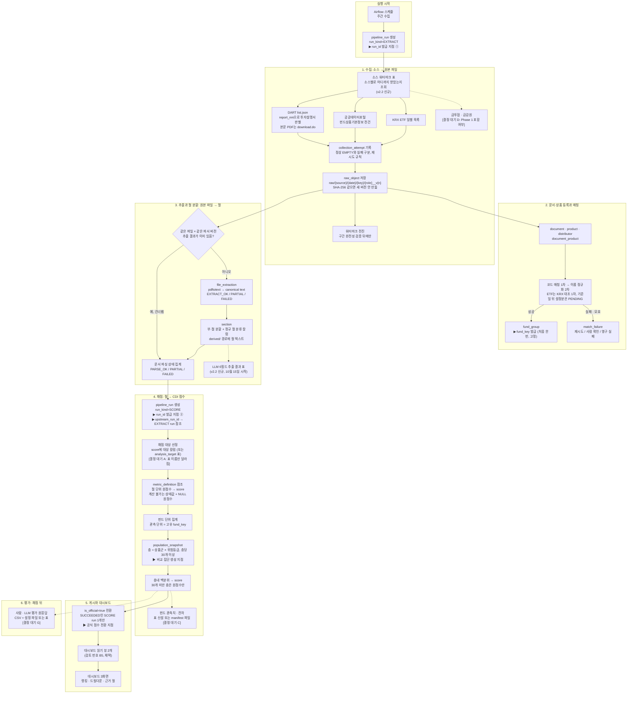

# 2단계 데이터 파이프라인 Flow 설계 입력

2단계 데이터 파이프라인 Flow 설계(기한 2026-09-30)의 Flow 다이어그램 초안과, 이어받는 결정 대기 항목, 선행 측정, 수집 일정 실측, 검토 의견.

## 상태

| 항목 | 값 |
|---|---|
| 설계 본문 | 초안 있음(2026-09-30, 「Flow 다이어그램 초안」 절). 결정 대기 A·C·D·G는 그림에 표시. 나머지 절은 입력 목록 |
| 기한 | 2026-09-30 |
| 입력 기준 | 현재 스키마·키·실행/모집단 계약은 [데이터 테이블·ERD 설계](data-model.md), [DBML](schema.dbml), [스키마 명세](schema-catalog.md) |
| 확정할 것 | 소스 4종 → 대시보드 흐름 다이어그램, DB·원문 저장소·Airflow 환경 |

## Flow 다이어그램 초안 (2026-09-30)

소스 4종에서 대시보드까지 한 장. 표 목록은 ERD v2.2 수정 확정안(9건, 9차 미팅 승인 대기) 기준이며, 결정 대기 A·C·D·G는 그림에 `[결정 대기 X]`로 표시함. 결정이 나면 그 상자만 고침.

표시 규칙

- 실선: 확정된 흐름. 점선: 결정 대기 또는 뒤 단계
- `▶`: 완료 조건이 요구한 표시 지점(run_id 발급 2곳, `upstream_run_id` 참조, 비교 집단 생성, `is_official` 전환, `fund_key` 발급)
- 상자 안 표 이름은 [DBML](schema.dbml) 기준. 「v2.2 신규」는 [ERD 재검토](records/phase1-erd/design-review-history.md) 수정 5의 표

### 단계별 표와 실행 종류

| 단계 | 읽는 표 | 만드는 것 | 실행(run) |
|---|---|---|---|
| 실행 시작 | 없음 | `pipeline_run` 1행, EXTRACT run_id | EXTRACT |
| 1 수집 | 소스 워터마크(v2.2 신규) | `collection_attempt`, `raw_object`, 원본 파일(`raw/`), 워터마크 전진 | EXTRACT |
| 2 등록·매칭 | `raw_object`, `distributor` | `document`, `product`, `document_product`, `fund_group`(fund_key), `match_failure`. `product_distributor`는 D 결정에 따라 | EXTRACT |
| 3 추출·절 | `raw_object`, `file_extraction`(같은 파일×파서 버전 있으면 건너뜀) | `file_extraction`, `section`(정규 절 분류 포함), 파싱 상태, `derived/` 텍스트, LLM 6필드 추출 결과(v2.2 신규) | EXTRACT. 키는 파일 × 파서 버전(수정 2) |
| 4 채점 | `section`, `fund_group`, `metric_definition`, upstream EXTRACT run | `pipeline_run`(SCORE), `score`(원점수·상태·백분위), `population_snapshot`. A·C 결정에 따라 `analysis_target`·펀드 관측치 표 | SCORE. `upstream_run_id`로 EXTRACT 참조, 산식만 바뀌면 3단계 재실행 없음 |
| 5 게시 | `score`, `population_snapshot`, `section` | `is_official` 전환, 읽기 뷰 2개 | SCORE |
| 6 평가 | `score`, `section` | G 결정에 따라 CSV+설정 파일 또는 표 | SCORE run 참조 |

### 결정 대기가 그림에 미치는 범위

| 결정 | 그림 위치 | 결정 뒤 바꿀 것 |
|---|---|---|
| A analysis_target 병합 | 4단계 P1 | 상자 이름만. 흐름 동일 |
| C 펀드 관측치 표 | 4단계 P6 | 점선을 실선으로 바꾸고 「표」 또는 「manifest 파일」 하나만 남김 |
| D product_distributor 시점 | 1단계 C4 | Week 5 포함이면 실선 + 2단계에 `product_distributor` 추가. Phase 2면 상자 제거 |
| G 평가 저장 방식 | 6단계 V1 | 하나만 남김. 채점 이전 단계 영향 없음 |
| B·E·F·H·I | 없음 | 칼럼·제약 설계. 그림 변경 없음 |

### 이 초안이 전제한 것

- ERD v2.2 수정 확정 9건 중 그림에 들어간 것: 2(추출 키 = 파일 × 파서 버전), 4(정규 절 분류 칼럼), 5(워터마크 표·LLM 추출 표). 9차 미팅 승인 전이면 「승인 대기」로 읽음
- 채점·평가 표 4개 연기(수정 1)에 따라 `score_dependency`·`evaluation_*`·`analysis_target_member`는 그림에 없음
- DB 제품·원문 저장소·Airflow 환경은 2026-10-07 결정. 그림은 논리 흐름만이며 어느 상자가 어느 서버에서 도는지는 정하지 않음
- 소스 간 중복률 측정(「먼저 측정할 것」)은 3단계 절 출력끼리 비교하는 별도 작업이라 그림에 넣지 않음. 중복이 실재하면 2단계와 3단계 사이에 중복 제거 상자가 추가됨
- 3단계 `derived/` 경로는 현행 규칙상 EXTRACT run 아래에 있음. 수정 2가 반영되면 파일 × 파서 버전 기준으로 바뀌며 [ERD 재검토](records/phase1-erd/design-review-history.md)의 검토 항목 B9(derived 경로의 서러게이트 ID 제거·manifest 내용 주소화)가 함께 해소됨

## 1단계에서 넘어온 결정 대기 항목

| 항목 | 넘긴 이유 | 근거 위치 |
|---|---|---|
| 소스 간 중복 제거 규칙 | 실제 중복률 모름. 측정 전 규칙 설계는 불필요한 작업 | 「먼저 측정할 것: 소스 간 중복률」 |
| CAS(`blobs/{sha256}`) 채택 재판단 | 원본 보관 규칙이 「소스 간 중복이라는 다른 근거가 생길 때」로 조건을 걸어 둠. 위 측정이 그 조건. 단 CAS는 서로 다른 파일 안의 같은 구간을 못 잡음(불채택 근거) | [원본 보관과 수집·파싱 실패 처리 규칙](storage-and-failure-rules.md) 「미결」 |
| KRX 일별 스냅숏과 상장폐지 후보 | 과거 백필과 이후 증분 수집을 함께 설계. 스냅숏 차집합은 후보 신호. 휴장·실패·불완전 응답을 제외하고 공식 근거와 대조해야 상장폐지 확정 | [점수 저장과 비교 모집단](scoring-and-population.md) 「판매 중 확인」 |
| SCD2 · `is_current` 물리화, 버전 PK와 논리 product_id 분리 | 현재 PK(valid_from/valid_to 두 칸)로 여러 버전 적재 불가 | [점수 저장과 비교 모집단](scoring-and-population.md) 「이력 요구」 |
| 재처리 오케스트레이션(Airflow), 재처리 스케줄·큐 구현 | 실패 처리 규칙이 2단계 책임으로 명시 | [원본 보관과 수집·파싱 실패 처리 규칙](storage-and-failure-rules.md) 「문서 파싱 상태」 |
| 저장 제품·원자적 게시 방식·백업 스케줄 | 원본 보관 규칙이 2단계로 명시 | [원본 보관과 수집·파싱 실패 처리 규칙](storage-and-failure-rules.md) 「미결」 |
| 조건부 검증 규칙의 구현 방식 | 기본값 = DB 중립 적재 검증기, DB 제약은 보강. DuckDB·SQLite·BigQuery는 트리거·FK 강제가 없거나 제한적 | [데이터 테이블·ERD 설계](data-model.md) 「절과 점수 대상」 |
| enum 구현(PG enum vs CHECK) | DB 제품별 구현 차이 | [스키마 명세](schema-catalog.md) 「Enum 상태값」 |
| PK 물리 타입·발급 방식, CHECK, timestamp 시간대(UTC 명시), decimal 정밀도 | DB 제품 선택 전 | [데이터 테이블·ERD 설계](data-model.md) 「미결」 |
| 공식 run 게시/해제 감사 로그 | `published_at`은 마지막 게시 시각만 보존 | [스키마 명세](schema-catalog.md) 「pipeline_run」 |
| 대규모 별칭 이력 관리 | fund_group 이름 변경 대응을 manifest 밖으로 확장할지 | [데이터 테이블·ERD 설계](data-model.md) 「상품과 법인」 |
| derived 경로의 서러게이트 ID 제거·manifest 내용 주소화 (검토 번호 B9) | PK 재발급 시 경로 무효 | [데이터 테이블·ERD 설계](data-model.md) 「미결」 |
| 평가 자료 접근 분리 (검토 번호 B4) | 사람 실험 원응답이 공개 원본과 같은 RAW_ROOT·DB | 같은 위치 |
| 대시보드 서빙 API 계약·승인 점수 뷰 (검토 번호 B5) | 권고: 2단계 첫 항목. 드릴다운·랭킹 쿼리 2개를 먼저 짜 보고 read model 필요 여부 확인 | 같은 위치 |
| artifact 레지스트리 표 (검토 번호 B3) | 경로+sha 7쌍 산재 | 같은 위치 |
| 물리 적재 | DBML은 논리 타입·관계만. DB 결정은 10-07 | [데이터 테이블·ERD 설계](data-model.md) 「미결」 |

## 먼저 측정할 것: 소스 간 중복률

- 2단계의 여러 항목(중복 제거 규칙, CAS 재판단)이 이 측정 하나에 걸림
- 회귀 전에 닫아야 하는 이유: 중복이 실재하면 회귀 관측치와 층화 분모가 실제보다 크게 나오고 표준오차 과소추정. 3단계에서 「회귀를 돌리다 보니 확인」하는 순서면 늦음 → 선행 조건

### 파일 해시로는 0만 나오는 이유 (09-20 변경)

- 간이투자설명서가 DART에서는 별도 문서가 아니라 투자설명서 PDF 안의 절(「요약 정보 <간이투자설명서> 작성기준일…」)
- 금투협은 별도 PDF로 제공, DART는 본문 안에 포함
- 서로 다른 파일 안의 같은 구간이라 파일 해시가 겹칠 수 없음 → 파일 단위 `sha256` 교집합은 구조상 0
- 근거: [DART 본문 PDF 부·절 분할 실현성 검증](records/phase1-erd/dart-section-split.md) 「함의」

### 측정 방법

- 금투협 간이투자설명서 PDF ↔ DART 투자설명서 PDF 내 요약 구간을 절 단위로 대조
- `research/scripts/dart_sections.py`의 절 출력끼리 비교([스크립트](../research/scripts/dart_sections.py))
- 간이투자설명서가 양쪽에서 오는 것만 확인됨. 같은 원고라도 생성 경로가 다르면 해시가 다를 수 있어 실제 중복률 미확인

### 결과별 분기

| 결과 | 다음 작업 |
|---|---|
| 중복 실재 | 소스 간 중복 제거 규칙 설계. CAS는 이 중복을 못 잡으므로 CAS 불채택 근거로 사용 |
| 중복 0 | 중복 제거 규칙·CAS 둘 다 불필요. 「문서 1건 = 펀드 1건」 논증 유지 |

## 수집 일정에 관한 실측

### 금투협 조회 창 (09-20, 호출 7회)

| 요청 기간 | 결과 |
|---|---|
| 1개월 `20260815~20260915` | 6,845행 (5.7MB) |
| 6개월 `20260315~20260915` | 125,069행 (104MB) |
| 11개월 `20251015~20260915` | 225,177행 (186MB) |
| 정확히 1년 `20250915~20260915` | 0행 (657바이트) |
| 1년+1일 / 1년+1개월 | 0행 |
| 2년 전 3일치 `20240813~20240815` | 2,044행 |

- 제약은 한 번에 조회하는 기간 폭. 소급 한계 아님
- 경계: 1년 미만. 정확히 1년부터 0행
- 백필은 언제든 가능. 1년 미만 창으로 분할 → 일정 리스크 아님
- 주의: 창 초과 시 오류가 아니라 HTTP 200 + 정상 XML + 0행. `uRptAllYN` 사례와 같은 형태
  - 넓은 창으로 도는 백필은 「그 기간엔 공시가 없었다」로 오류 없이 잘못 읽음
  - 조치: 수집 모듈에 창 폭 검증 필요
- 응답 크기: 6개월 104MB, 11개월 186MB → 1개월 단위 분할이 현실적
- 조회 창 상세: [데이터 소스 수집 명세](data-sources.md)

### KRX 소급 범위 (09-20)

- KRX가 과거 일자를 최소 10년까지 반환(2016-09-02 기준 226건 조회 성공)
- 「오늘 안 받으면 재구성 불가」는 ETF에 해당하지 않음
- 적재 주기·보관 범위 결정은 2단계에 그대로 둠
- 성격 변경: 「늦으면 잃는다」가 아니라 「매번 다시 받는 비용」 문제
- 상장폐지 후보 차집합도 과거 구간에서 생성 가능. 확정에는 거래일·응답 완전성·공식 상장폐지 근거 필요

### 금감원 제재 API (09-21~22)

- 개인용 키: 한 호출 최대 1개월. 초과 시 `resultCode=030`. 스크립트는 `CHUNK_DAYS=28`
- 일일 조회 건수 30회(`resultCode=033`). 제재·경영유의사항 두 엔드포인트가 같은 키의 한도 공유
- 법인 키 상한은 미확인
- 페이징 없음. 5,700여 건 백필은 기간 분할로만 가능
- 상세: [데이터 소스 수집 명세](data-sources.md)

## KRX 대조 실행 시점

- 두 소스의 기준일이 다르면 신규 설정분이 항상 오탐으로 잡힘
  - 실측: KRX 기준일 09-04, 포털 09-19. 기준일 이후 설정 4건(0.9%)
- 규칙: 포털 `setpDt`가 KRX `basDd`보다 뒤인 건은 오탐이 아니라 `PENDING`
- 2단계의 「KRX 대조를 언제 돌릴 것인가」에 이 규칙 포함
- 근거: [금투협 중복 행과 ETF 이름 규칙 검증](records/phase1-erd/kofia-rows-and-etf-rule.md) 「검증 2: ETF 이름 규칙」

## 검토 의견(승인 아님)

- 출처: 09-23 v2 6관점 검토의 관점별 요약([ERD 설계 변천과 검토 기록](records/phase1-erd/design-review-history.md) 「v2 6관점 검토」)
- 행 수·용량·작업량 추정치의 정확성은 검증하지 않음

### platform 관점: 09-26 인계 골든패스

- 골든패스: 수집→파싱→매칭 12표 + 로더 계약 6단계 + 검증기 6개
  - 검증기 6개: 경로 정규화, EXTRACT_OK 조건부 필수, char 범위, 원본 불변, 시도·바이트 분리, 완료 시 input_manifest
- 채점 5표: 「칼럼 확정, 조건부 규칙은 2단계 백로그」
- DBML 밖 규칙 약 42개(추정): 단일 행 CHECK 14, 교차 행 트리거/검증기 16, 파일 내용 검증 10
  - 2~3명 파트타임 기준 3~5 인·주(추정)를 채점 행 1건 적재 전에 선행
  - 수집→파싱만이면 규칙 6개
- 표 배치 권고: 지금 17, 3단계 예약 3(DBML 제외), 삭제 0

### cloud 관점: 최소 구성

| 항목 | 값 |
|---|---|
| run당 행 수 (추정) | score 약 3.6M, score_dependency 약 3.4M(AXIS 이상만 저장하면 0.1M), analysis_target 약 225k, member 약 250~300k |
| 전량 재실행 1회 (추정) | 약 8M행 · 5~10GB |
| DB 판단 | Postgres/DuckDB에서 가벼움. SQLite는 단일 writer라 Airflow 병렬 적재에 비권고 |
| 원본 저장 | 금투협 수시공시 백필이 지배. 연 약 250GB (추정, 미측정). 비용은 결정 요인 아님 |

- 최소 아키텍처 제안: PostgreSQL 1개(core/eval 스키마) + 객체 스토리지
  - 객체 스토리지 구성: raw/ Object Lock, derived/ lifecycle, manifests/ 내용 주소화, restricted/eval/
  - 부가 구성: artifact 표, 게시 규약(임시 키 → sha 검증 → 최종 키 → DB 커밋), 야간 fsck, run 보존 정책

### backend 관점: 드릴다운 쿼리 부담

- 드릴다운(문서→절별 원점수·백분위·근거): 조인 5 + 복합키 3
  - 근거 스팬까지 렌더링하면 실질 조인 7 + JSON 파싱 2단 + structure_manifest 파일 I/O가 요청 경로에 포함
- 층내 최하위 Top-N: 조인 6, 층 조합마다 전수 스캔·정렬 → read model 없이는 문서 총량에 선형
- 응답 envelope 제안: [3단계 입출력 Schema 설계 입력](io-schema.md) 「CDI 출력 요구」

## 실행 환경 요구

| 요구 | 이유 |
|---|---|
| poppler(`pdftotext`) | DART 본문 PDF 부·절 분할. 저장소의 기존 스크립트는 외부 의존성이 없었으나 PDF 텍스트 추출 직접 구현은 범위 밖 → 예외로 수용, 배포 환경 요구 사항 |
| curl | 금투협 전자공시 호출. Python `urllib`로는 응답이 중간에 잘림(1,499행 중 43행만 도착). 응답이 `</root>`로 끝나는지 확인 필수([금투협 중복 행 검증](records/phase1-erd/kofia-rows-and-etf-rule.md) 「검증 1: 금투협 중복 행」) |
| 금감원 법인 키 요청 IP 등록 | 법인 키에만 요청 IP 등록이 붙음. 수집 서버 IP 확정 전 신청하면 재신청 필요 |

## 별도 작업

- KRX 매칭 실패 229건 수동 확인
  - 2단계 설계 산출물 아님. 사람이 손으로 채우는 작업
  - 칸(`etf_confidence`)이 이미 있어 나중에 채워도 됨
  - 09-20 안건 권고: 별칭 사전 대신 229건 1회 수동 매핑(원인: 브랜드 개명 ACE←KINDEX, `(합성)` 표기)

## 미결

| 질문 | 결정 주체 | 필요 시점 |
|---|---|---|
| 소스 간 중복률 측정 담당·일정 | [담당 미정] | 2026-09-30 |
| KRX 매칭 실패 229건 처리 방침(1회 수동 매핑 권고). 09-20 안건 결과 기록 없음 | 팀 / 09-20 회의록 확인 | 2026-09-30 |
| KRX 일별 스냅숏 적재 주기·보관 범위 | 팀 | 2026-09-30 |
| 조건부 검증 규칙 구현 방식(적재 검증기 기본안 확정 여부)과 규칙 약 42개의 구현 순서 | 팀 | 2026-09-30 |
| DB 제품·원문 저장소·Airflow 환경 | 팀 | 2026-10-07 |
| 검토 번호 B3·B4·B5·B9 결정 | 팀(09-30 9차 미팅) | 2026-09-30 |

## 참고

- 스키마: [데이터 테이블·ERD 설계](data-model.md)
- 원본 경로·실패 규칙: [원본 보관과 수집·파싱 실패 처리 규칙](storage-and-failure-rules.md)
- 수집 호출 방법: [데이터 소스 수집 명세](data-sources.md)
- 대체된 옛 판단(금투협 「1년 지나면 영구 소실」, KRX 「오늘 안 받으면 재구성 불가」): [조인 키 확인 기록](records/phase1-erd/join-key-checks.md) 「정정 이력」, [ERD 설계 변천과 검토 기록](records/phase1-erd/design-review-history.md)
